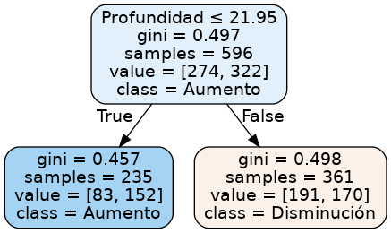

```{r setup, include=FALSE}
knitr::opts_chunk$set(echo = TRUE, message = FALSE, warning = FALSE)
library(reticulate)
use_python("/usr/bin/python3")
library("bookdown")
```

# Introducción
Los sismos son un fenómeno natural muy presente en nuestro país. El fenómeno es aún impredecible.

Algunas correlaciones con otros fenómenos han sido estudiadas. Entre ellas, se indagó principalmente en 2 estudios: el primero, sobre la relación de los sismos con las lluvias monzónicas en el Himalaya, y el segundo, sobre la influencia del sol en ellos.

Resultados del primer estudio mostraron que la frecuencia de sismos en el Himalaya se veía disminuida con los eventos monzónicos. Del segundo estudio, se extrajo que los datos sugerían que la mayor cantidad de sismos ocurrían en horarios diurnos

Por otro lado, un sismo también puede tener consecuencias, por lo que se decidió indagar si los sismos tienen un impacto en las enfermedades transmitidas por alimentos. El  poder determinar si existe una relación entre estos eventos podría ayudar a desplegar infraestructura y recursos humanos después de un desastre, además de ayudar en la generación de políticas públicas que ayuden a mitigar los efectos secundarios.

Sin embargo, posterior a la exploración de los datos en el Hito 1, se decidió que la hipótesis a trabajar debía ser diferente a la trabajada anteriormente, porque los datos obtenidos sugerían que no habían relaciones claras entre los datos como para generar un predictor.

Se añadió al conjunto de _dataset_ una base de datos de egresos hospitalarios, con el fin de direccionar la experimentación a hacia el aumento o la disminución de egresos hospitalarios y de enfermedades transmitidas por alimentos.


## Hipótesis

### Hito 1 {#hipotesis-hito-1}
Se tenían las siguientes hipótesis.

**Configuración A:** Correlación entre clima y terremotos en Chile.

Esta configuración surge de la siguiente pregunta: ¿existirá una relación entre el clima y los terremotos? Las hipótesis que puede surgir son:
Existe una correlación entre los cambios estacionales del año y la frecuencia de los terremotos.
Existe una correlación entre precipitaciones fluviales y sismos o con sismos de gran magnitud.

En base a las observaciones y trabajos con estos datos, se decidió que la cantidad de terremotos tenían más que nada cierta estacionalidad, independiente de las condiciones meteorológicas.
Por esto, se descartó la predicción de cantidad de sismos en base a estos y se propuso su uso para la predicción de ingresos hospitalarios y/o enfermedades transmitidas por alimentos.

**Configuracion B:** Correlación entre sismos y enfermedades transmitidas por alimentos en Chile.

Esta configuración surge después de la pregunta si los terremotos presentan alguna correlación con la salud de los chilenos. En particular, si, debido a los daños en infraestructura que generan los terremotos se provoca un aumento en las enfermedades transmitidas por alimentos de los chilenos. Surgió la hipótesis:
Existe una correlación entre las enfermedades transmitidas por alimentos y la ocurrencia de eventos sísmicos, en particular aquellos de mayor magnitud.

Al finalizar la exploración y extraer más gráficos, se intuía que no se veían afectadas en mayor medida por los sismos, salvo por (probablemente) aquellas producidas por deshidratación.
Por eso, se decidió conservar este dataset y trabajar en posibles métodos de predicción.


### Hito 2

En base a lo expuesto en la Sección \@ref(hipotesis-hito-1), se planteó una nueva hipótesis, para nuevas configuraciones:

**Configuración A**: Correlación entre sismos y cantidad de egresos hospitalarios en Chile.

Hipótesis: Los sismos inciden en la cantidad de ingresos hospitalarios por cada región.

**Configuración B**: Correlación entre sismos y cantidad de reportes de enfermedades transmitidas por alimentos en Chile.

Hipótesis: Los sismos inciden en la cantidad de enfermedades transmitidas por alimentos, particularmente por deshidratación (como se sugirió con los datos del Hito 1).


## Metodología
Se busca juntar los datasets, como los de sismos, precipitaciones fluviales, temperatura y eventos de salud para buscar las correlaciones mencionadas más arriba. La forma de juntarlos sería mediante la posición de los eventos (latitud/longitud) o región, en caso que corresponda, y la fecha en que se produjeron. De esta manera se encontrará la correlación entre los eventos planteados en para confirmar o rechazar las hipótesis.


# Descripción de los datos
A continuación se mostrará una descripción de los datos que se van a utilizar.

## Datos sismológicos
IRIS Incorporated Research Institutions for Seismology
Sus siglas en español: Institutos de investigación corporativos de sismología. IRIS provee equipamiento y acceso sísmico y otros datos alrededor del mundo, cortesía una red sismógrafos de la comunidad científica  internacional y de Estados Unidos. IRIS provee accesos a datos sísmicos a través de servicios online. Siendo Chile uno de los paises con mas frecuencia de sismos en el mundo, IRIS clasifica los sismos dentro de la región de Chile dentro de un cuadro limitado por coordenadas definidas por el mismo instituto (máxima latitud=-15.400, mínima latitud=-57.000, máxima longitud=-63.800, mínima lon=-83.100). Como se muestra en el gráfico a continuación

```{r map, echo=FALSE, message=FALSE}
# Carga de los datos e importacion de librerias
library(ggplot2)
library(dplyr)
library(tidyverse)
library(caret)
library(dplyr)
library(ggmap)

data <- read.delim("Datasets sismológicos/all.csv", header = TRUE, sep = "|", quote = "\"",
           dec = ".", fill = TRUE, comment.char = "#")

mapData = tail(data, n=100)
# calculate borders
height <- max(mapData$Latitude) - min(mapData$Latitude)
width <- max(mapData$Longitude) - min(mapData$Longitude)
sac_borders <- c(bottom  = min(mapData$Latitude)  - 0.1 * height, 
                top     = max(mapData$Latitude)  + 0.1 * height,
                left    = min(mapData$Longitude) - 0.1 * width,
                right   = max(mapData$Longitude) + 0.1 * width)

map <- get_stamenmap(sac_borders, zoom = 5, maptype = "toner-lite")
ggmap(map) +
  geom_point(data = mapData, mapping = aes(x = Longitude, y = Latitude,
        col = Depth, size = Magnitude)) +
  scale_color_distiller(palette = "YlOrRd", direction = 1)
```

Dentro de los datos que se utilizaran para el analysis estan: longitud, latitud, magnitud, profundidad, y tiempo
Longitud y latitud son parte del sistema de coordenadas geográficas es un sistema que referencia cualquier punto de la superficie terrestre y que utiliza para ello dos coordenadas angulares, latitud (norte o sur) y longitud (este u oeste).
Magnitud es una medida que tiene relación con la cantidad de energía liberada en forma de ondas.
Profundad define la distancia entre el epicentro de un terremoto con respecto al nivel del mar.
Tiempo es el registro del evento.

### Profundidad y magnitud

Los siguientes gráficos muestra el impacto de las zonas en Chile sin utilizar un mapa. En otras palabras, podemos apreciar las magnitudes por latitud.

```{r lat_mag}
ggplot(data, aes(x = Magnitude, y = Latitude)) + 
  geom_point() + 
  coord_flip()
```

De la misma manera podemos mostrar los datos de profundidad por latitud.

```{r lat_depth}
ggplot(data, aes(x = Depth, y = Latitude)) + 
  geom_point() + 
  coord_flip()
```

### Sismos por estaciones del año

Primero mostramos la gráfica de sismos a través de las estaciones del año tomando en cuenta datos desde el año 1960 hasta el 2019.

```{r, message=FALSE}
# load libraries
library(tidyverse)
library(lubridate)

# create new columns 

dtime = as.Date(data$Time)
season_data <-  mutate(data,
  year = year(dtime),
  month = month(dtime),
  mday = mday(dtime)
)

# consider the limitation of seasons simply by looking into range of values
# we bound the seasons by month value, 
# we round the days of the season boundary. E.g. Sept 21 -> OCT

season_data <- mutate(season_data,
  season = case_when (
      month >= 4 & month <= 6 ~ "otonio",
      month >= 7 & month <= 9 ~ "invierno",
      month >= 10 & month <= 12 ~ "primavera",
      month >= 1 & month <= 3 ~ "verano"
    )
) 


# install if needed ggpubr
#install.packages("ggpubr")
library(ggpubr)

bplot <- season_data %>% 
  # filter(year > 2010) %>% 
  ggplot(mapping = aes(x=season)) + 
  geom_bar()

dplot <- season_data %>% 
  group_by(season) %>% 
  summarise(total = n()) %>% 
  ggplot(mapping = aes(x=season, y=total)) +
  geom_point() 

ggarrange(bplot, dplot,
                    ncol = 2, nrow = 1)

```


El primer gráfico puede dejar un poco la duda de la diferencia que existe entre estos. Figura 2 muestra claramente la diferencia entre la frecuencia de eventos sísmicos en las estaciones del año. Podemos ver que Otoño y Verano tienen mayor frecuencia de terremotos.

### Cantidad de datos del dataset

El gráfico de abajo muestra la cantidad de reportes recolectados por año, dentro de las inferencias, y consultas hechas los outliers que puedan ser registrados con equipos antiguos están exentos por ser mínima en su cantidad.

```{r}
ggplot(season_data, mapping = aes(x=year)) +
  geom_bar()
```

## Datos de precipitaciones fluviales

Los datos fluviales fueron extraídos de la página web de CR2. Fueron tomados desde enero de 1900 hasta febrero de 2018, en 874 estaciones de todo Chile. Existen 2 variantes: la resolución temporal mensual o diaria. Las precipitaciones están medidas en milímetros.

Las dimensiones del dataset corresponden a 874 filas y 1431 columnas, correspondientes a los datos obtenidos en todos los años desde 1900 a 2018, por cada estación. Además, presentan datos como la latitud y longitud de la estación, la altura a la que se encuentra sobre el nivel del mar y la cuenca a la que pertenecen.

Se puede explorar el dataset de la siguiente forma:
```{r}
# Importar dataset de lluvias mensuales
prAmon <- t(read.csv("https://anakena.dcc.uchile.cl/~cllull/IntroMineriaDatos/DataSets/cr2_prAmon_2018/cr2_prAmon_2018.txt"))

colnames(prAmon) <- as.character(unlist(prAmon[1, ])) # Le pone nombre a las columnas
prAmon <- prAmon[-1, ] # Extrae los datos

prAmon_na <- prAmon # Copia de prAmon
prAmon_na[prAmon == -9999] <- NA # Todas las celdas con -9999 a NA
```
Se deben declarar como NA los datos con -9999 que representan datos faltantes, para que R los trabaje de buena manera.

Luego se aplica el promedio de todos los años desde 1900 a 2018, evitando los NA.
```{r}
library(dplyr)
data <- prAmon_na[, 15:1431]  # Los datos de lluvia, sin descripción
data <- as.data.frame(data)  # De matrix a data.frame
data[,] <- apply(data[,], 2, function(x) as.numeric(x)) # Valores de character a numeric
prAmonMean <- prAmon_na[, 1:14]  # Tabla para poner el promedio
prAmonMean <- as.data.frame(prAmonMean)  # De matrix a data.frame
mean <- rowMeans(data, na.rm = TRUE)  # Calcula el promedio
prAmonMean$mean <- mean  # Pone el promedio en la tabla
```
Para graficar por último:
```{r}
library(ggplot2)
ggplot(prAmonMean) +
  geom_bar(aes(x = nombre, y = mean), stat="identity") +
  ggtitle("Promedio de precipitaciones en cualquier época del año desde 1900 a 2018\n
para estaciones de Chile") + # título
  xlab("Nombre estación") + ylab("Promedio precipitaciones")  # etiquetas
```

Pero no es para nada claro, debido a que Chile tiene muchos climas distintos. Así, es mejor separar por regiones. La clasificación se hace de manera arbitraria, determinando las latitudes en las cuales las regiones, aproximadamente, se separan.
```{r}
prAmonMean$latitud <- as.numeric(as.character(prAmonMean$latitud)) # Se debe hacer numérico
prAmonMean_arica <- filter(prAmonMean, latitud <= -17.46 & latitud >= -19.07)
prAmonMean_magallanes <- filter(prAmonMean, latitud < -49.10 & latitud >= -56)
```
De esta manera, se obtienen los siguientes gráficos:

```{r, echo=FALSE}

ggplot(prAmonMean_magallanes) +
  geom_bar(aes(x = nombre_cuenca, y = mean), stat="identity") +
  ggtitle("Promedio de precipitaciones en cualquier época del año desde 1900 a 2018\n
para estaciones de la Región de Magallanes") + # título
  theme(axis.text.y = element_text(angle = 45, hjust = 1)) +
  xlab("Nombre cuenca") + ylab("Promedio precipitaciones") + coord_flip(expand = TRUE) # etiquetas

ggplot(prAmonMean_arica) +
  geom_bar(aes(x = nombre_cuenca, y = mean), stat="identity") +
  ggtitle("Promedio de precipitaciones en cualquier época del año desde 1900 a 2018\n
para estaciones de la Región de Arica y Parinacota") + # título
  theme(axis.text.y = element_text(angle = 30, hjust = 1)) +
  xlab("Nombre cuenca") + ylab("Promedio precipitaciones") + coord_flip(expand = TRUE) # etiquetas
```


Ahora sí se aprecia una diferencia respecto al norte y al sur. Sin embargo, lo más ilustrativo que se puede obtener es determinar las precipitaciones en cada mes del año. De la siguiente forma se extraen las precipitaciones mensuales para la región de Arica:
```{r, message=FALSE, echo=FALSE}
# Datos de arica:
prAmon_na <- as.data.frame(prAmon_na)
prAmon_na$latitud <- as.numeric(as.character(prAmon_na$latitud))
prAmonArica <- filter(prAmon_na, latitud <= -17.46 & latitud >= -19.07)

# Clasificación por meses
prAmonArica_ene <- prAmonArica %>% select(ends_with("01"))
prAmonArica_ene <- apply(prAmonArica_ene, 2, function(x) as.numeric(as.character(x)))
prAmonArica_feb <- prAmonArica %>% select(ends_with("02"))
prAmonArica_feb <- apply(prAmonArica_feb, 2, function(x) as.numeric(as.character(x)))
prAmonArica_mar <- prAmonArica %>% select(ends_with("03"))
prAmonArica_mar <- apply(prAmonArica_mar, 2, function(x) as.numeric(as.character(x)))
prAmonArica_abr <- prAmonArica %>% select(ends_with("04"))
prAmonArica_abr <- apply(prAmonArica_abr, 2, function(x) as.numeric(as.character(x)))
prAmonArica_may <- prAmonArica %>% select(ends_with("05"))
prAmonArica_may <- apply(prAmonArica_may, 2, function(x) as.numeric(as.character(x)))
prAmonArica_jun <- prAmonArica %>% select(ends_with("06"))
prAmonArica_jun <- apply(prAmonArica_jun, 2, function(x) as.numeric(as.character(x)))
prAmonArica_jul <- prAmonArica %>% select(ends_with("07"))
prAmonArica_jul <- apply(prAmonArica_jul, 2, function(x) as.numeric(as.character(x)))
prAmonArica_ago <- prAmonArica %>% select(ends_with("08"))
prAmonArica_ago <- apply(prAmonArica_ago, 2, function(x) as.numeric(as.character(x)))
prAmonArica_sep <- prAmonArica %>% select(ends_with("09"))
prAmonArica_sep <- apply(prAmonArica_sep, 2, function(x) as.numeric(as.character(x)))
prAmonArica_oct <- prAmonArica %>% select(ends_with("10"))
prAmonArica_oct <- apply(prAmonArica_oct, 2, function(x) as.numeric(as.character(x)))
prAmonArica_nov <- prAmonArica %>% select(ends_with("11"))
prAmonArica_nov <- apply(prAmonArica_nov, 2, function(x) as.numeric(as.character(x)))
prAmonArica_dic <- prAmonArica %>% select(ends_with("12"))
prAmonArica_dic <- apply(prAmonArica_dic, 2, function(x) as.numeric(as.character(x)))

prAmonAricaMeses <- prAmonArica[, 1:14]

prAmonAricaMeses$enero <- rowMeans(prAmonArica_ene, na.rm = TRUE)
prAmonAricaMeses$febrero <- rowMeans(prAmonArica_feb, na.rm = TRUE)
prAmonAricaMeses$marzo <- rowMeans(prAmonArica_mar, na.rm = TRUE)
prAmonAricaMeses$abril <- rowMeans(prAmonArica_abr, na.rm = TRUE)
prAmonAricaMeses$mayo <- rowMeans(prAmonArica_may, na.rm = TRUE)
prAmonAricaMeses$junio <- rowMeans(prAmonArica_jun, na.rm = TRUE)
prAmonAricaMeses$julio <- rowMeans(prAmonArica_jul, na.rm = TRUE)
prAmonAricaMeses$agosto <- rowMeans(prAmonArica_ago, na.rm = TRUE)
prAmonAricaMeses$septiembre <- rowMeans(prAmonArica_sep, na.rm = TRUE)
prAmonAricaMeses$octubre <- rowMeans(prAmonArica_oct, na.rm = TRUE)
prAmonAricaMeses$noviembre <- rowMeans(prAmonArica_nov, na.rm = TRUE)
prAmonAricaMeses$diciembre <- rowMeans(prAmonArica_dic, na.rm = TRUE)


library(tidyverse)
prAmonAricaMeses_mean <- gather(prAmonAricaMeses, key="Mes", value="Promedio", enero:diciembre)

prAmonAricaMeses_mean$Mes <- factor(prAmonAricaMeses_mean$Mes, levels = c("diciembre", "noviembre", "octubre", "septiembre", "agosto", "julio", "junio", "mayo", "abril", "marzo", "febrero", "enero"))

ggplot(prAmonAricaMeses_mean) +
  geom_bar(aes(x = Mes, y = Promedio), stat="identity") +
  ggtitle("Promedio de precipitaciones en la región\n
de Arica y Parinacota respecto a cada mes\n") + # título
  theme(axis.text.y = element_text(angle = 30, hjust = 1)) +
  xlab("Mes") + ylab("Promedio precipitaciones") + coord_flip(expand = TRUE)
```


## Datos de temperaturas

Los datos de temperaturas máximas, mínimas y medias fueron extraídos de la página del CR2, al igual que los datos de precipitaciones. Por esto, tienen la misma clasificación que ellos.

## Datos de salud alimentaria

Los datos de salud alimentaria fueron extraídos de la página web del Departamento de Estadísticas e Información de Salud, en www.deis.cl.
Se extrajeron datos de los brotes de enfermedades transmitidas por alimentos desde el año 2011 hasta el 2017, siendo estos todos los disponibles.

Para hacer una primera exploración de los resultados, se contó la cantidad de casos de enfermedades transmitidas por alimentos reportadas cada año para algunas regiones afectadas por terremotos grandes que ocurrieron en el periodo 2011-2017, aquellos de Iquique el año 2014 y de Illapel el año 2015.

Ahora, los sismos vienen con las columnas _Year_, _Month_ y _Day_, que fueron generados con una función similar a _agregarFechas_ que se encuentra en el anexo.
También incluyen las regiones: estas fueron generadas mediante la función *cargar_sismos_por_region* que se encuentra en el anexo.

```{r, echo=FALSE}
# Agregarle las fechas a las ETAs
agregarFechasEtas <- function(dataframe) {
  fechas <- as.Date(dataframe$Fecha.de.Ingestión, "%d-%m-%Y")
  fechas <- data.frame(Year=as.numeric(format(fechas, format="%Y")),
                       Month=as.numeric(format(fechas, format="%m")),
                       Day=as.numeric(format(fechas, format="%d")))
  fecha_num <- data.frame(num_date=fechas$Year +
                            (fechas$Month-1)/12 +
                            (fechas$Day-1)/24/12)
  fechas <- cbind(fechas, fecha_num)
  cbind(dataframe, fechas)
}
```

Se cargan los sismos con:
```{r cargarSismos}
sismos <- read.delim("http://anakena.dcc.uchile.cl/~rllull/CC5206/sismos.csv",
                     header = TRUE, sep = ",", quote = "\"", dec = ".", fill = TRUE, comment.char = "#")
```

El código para las ETAs se simplificó mucho, logrando unir los 7 datasets de ETAs en 1.
De esta manera, se cargan los datos de la forma:

```{r cargarEtas}
# Carga de las ETAs
etas <- read.delim("http://anakena.dcc.uchile.cl/~rllull/CC5206/etas2011_2017.csv",
                   header = TRUE, sep = ",", quote = "\"", dec = ".", fill = TRUE, comment.char = "#")

# Agregarle las fechas a las ETAs
etas <- agregarFechasEtas(etas)
```


Después, se guardan los datos en data frames *cant_etas* y *cant_etas_deshidratacion*, para obtener los siguientes gráficos:

```{r graficosETAs, echo=FALSE}

cant_etas <- data.frame("Año"=etas$Año.estadistico, "Región"=etas$Región.de.consumo,
                        "Cantidad"=etas$Región.de.consumo)
cant_etas <- aggregate(Cantidad ~ Año + Región, cant_etas, function(a) {sum(a>0)})

library(ggplot2)  # cargamos la librería

ggplot(cant_etas[cant_etas$Región == 4, ]) + # asociamos un data frame a ggplot
  geom_bar(aes(x = Año, y = Cantidad), stat="identity") +   # creamos un grafico de barras como una capa
  #coord_flip() +  # transformamos el grafico invirtiendo los ejes de coordenadas (sólo visualmente)
  ggtitle("Reportes de ETA anuales\npara la Región de Coquimbo") + # título
  xlab("Año") + ylab("Cantidad de ETA reportadas ese año")  # etiquetas

ggplot(cant_etas[cant_etas$Región == 1, ]) + # asociamos un data frame a ggplot
  geom_bar(aes(x = Año, y = Cantidad), stat="identity") +   # creamos un grafico de barras como una capa
  #coord_flip() +  # transformamos el grafico invirtiendo los ejes de coordenadas (sólo visualmente)
  ggtitle("Reportes de ETA anuales\npara la Región de Tarapacá") + # título
  xlab("Año") + ylab("Cantidad de ETA reportadas ese año")  # etiquetas

ggplot(cant_etas[cant_etas$Región == 2, ]) + # asociamos un data frame a ggplot
  geom_bar(aes(x = Año, y = Cantidad), stat="identity") +   # creamos un grafico de barras como una capa
  #coord_flip() +  # transformamos el grafico invirtiendo los ejes de coordenadas (sólo visualmente)
  ggtitle("Reportes de ETA anuales\npara la Región de Antofagasta") + # título
  xlab("Año") + ylab("Cantidad de ETA reportadas ese año")  # etiquetas

ggplot(cant_etas[cant_etas$Región == 3, ]) + # asociamos un data frame a ggplot
  geom_bar(aes(x = Año, y = Cantidad), stat="identity") +   # creamos un grafico de barras como una capa
  #coord_flip() +  # transformamos el grafico invirtiendo los ejes de coordenadas (sólo visualmente)
  ggtitle("Reportes de ETA anuales\npara la Región de Atacama") + # título
  xlab("Año") + ylab("Cantidad de ETA reportadas ese año")  # etiquetas

ggplot(cant_etas[cant_etas$Región == 5, ]) + # asociamos un data frame a ggplot
  geom_bar(aes(x = Año, y = Cantidad), stat="identity") +   # creamos un grafico de barras como una capa
  #coord_flip() +  # transformamos el grafico invirtiendo los ejes de coordenadas (sólo visualmente)
  ggtitle("Reportes de ETA anuales\npara la Región de Valparaíso") + # título
  xlab("Año") + ylab("Cantidad de ETA reportadas ese año")  # etiquetas

# Fase de graficar deshidratación
cant_etas_deshidratacion <- data.frame("Año"=etas[etas$Deshidratación == "SI", ]$Año.estadistico,
                                       "Región"=etas[etas$Deshidratación == "SI", ]$Región.de.consumo,
                                       "Cantidad"=etas[etas$Deshidratación == "SI", ]$Región.de.consumo)

cant_etas_deshidratacion <- aggregate(Cantidad ~ Año + Región, cant_etas_deshidratacion, function(a) {sum(a>0)})

ggplot(cant_etas[cant_etas_deshidratacion$Región == 1, ]) + # asociamos un data frame a ggplot
  geom_bar(aes(x = Año, y = Cantidad), stat="identity") +   # creamos un grafico de barras como una capa
  #coord_flip() +  # transformamos el grafico invirtiendo los ejes de coordenadas (sólo visualmente)
  ggtitle("Reportes de ETA por deshidratación anuales\npara la Región de Tarapacá") + # título
  xlab("Año") + ylab("Cantidad de ETA reportadas ese año")  # etiquetas

ggplot(cant_etas[cant_etas_deshidratacion$Región == 2, ]) + # asociamos un data frame a ggplot
  geom_bar(aes(x = Año, y = Cantidad), stat="identity") +   # creamos un grafico de barras como una capa
  #coord_flip() +  # transformamos el grafico invirtiendo los ejes de coordenadas (sólo visualmente)
  ggtitle("Reportes de ETA por deshidratación anuales\npara la Región de Antofagasta") + # título
  xlab("Año") + ylab("Cantidad de ETA reportadas ese año")  # etiquetas
```


# Pre-procesamiento de los datos

Con el nuevo objetivo definido, se buscó encontrar la correlación que se produce entre los sismos de alta magnitud y los informes de ETA.
Para ello, se decidió utilizar solamente aquellos sismos de magnitud mayor o igual a 5 Mw.

Además, de la misma forma como se hizo en la Exploración de los datos, se clasificaron los sismos por Región de Chile.
De esta manera, se construyó un dataset que tuviera todos los eventos sismológicos disponibles, clasificados por fecha. 


# Limpieza de los datos

La limpieza de los datos se realizó eliminando aquellas columnas que no representan un verdadero aporte para los casos de estudio.
Para ello, se seleccionaron los atributos de Magnitud, profundidad y región.

De esta forma, se eliminaron todos los otros atributos, dejando datasets más limpios y cómodos de trabajar, en especial para entrenar el clasificador.

El código que genera un archivo .csv con estos nuevos datos, se puede ver aquí:
```{r}
# Magnitud 6, 7 días
sismos_5 <- sismos[sismos$Magnitude >= 6 & sismos$Year >= 2011 & sismos$Year <= 2017, ]
datos <- data.frame(Magnitud = rep(0, nrow(sismos_5)),
                    Profundidad = rep(0, nrow(sismos_5)),
                    Region = rep(0, nrow(sismos_5)),
                    Aumento = rep(0, nrow(sismos_5)))
for (i in 1:nrow(sismos_5)) {
  el_sismo <- sismos_5[i, ]
  etas_ant <- etas[el_sismo$num_date - 7/30/12 <= etas$num_date & etas$num_date <= el_sismo$num_date, ]
  etas_post <- etas[el_sismo$num_date < etas$num_date & etas$num_date <= el_sismo$num_date + 7/30/12, ]
  dif <- nrow(etas_post) - nrow(etas_ant)
  
  datos[i, ]$Magnitud <- el_sismo$Magnitude
  datos[i, ]$Profundidad <- el_sismo$Depth
  datos[i, ]$Region <- el_sismo$Region_Number
  
  if (dif > 0) {
    datos[i, ]$Aumento <- 1
  }
}
write.csv(datos, "datos6_7d.csv", row.names=FALSE)
```
Aquí, puede apreciarse uno de los datasets, en este caso, para sismos de magnitud mayor o igual a 6 Mw y con un período de informes 7 días posterior al sismo y 7 días anterior a este.

Para obtener las ETAs correctas, se realizó la suma de los 7 días anteriores y 7 días posteriores, y se almacenó en una variable.
Ya se analizará la decisión de esto.


# Minería de datos

Dada la estructura de los datos, se diseñó un clasificador DecisionTree.
Así, se podrían identificar los atributos que el clasificador pudiera considerar importantes para hacer la predicción.

## Diseño experimental

Para generar correctamente un modelo de clasificación, se necesitó pensar en un procedimiento efectivo que dijera con certeza si un terremoto realmente provocó daños.
Esto, con base en la hipótesis de que mientras más daños pueda generar un sismo, más informes por ETAs se generan.
Además, se debió agregar la dimensión de temporalidad tan necesaria para apreciar estos datos.

De esta manera, se pensó en lo siguiente: si en los _n_ días antes del sismo se registraron menos informes por ETA que en los _n_ días después, quiere decir que el sismo aumentó los informes y por ende los daños. Esto se representa con un 1.
Por otro lado, si ocurre al revés, es un cero.

De esta forma, se generó la tabla cuyo código se encuentra en la sección anterior.

Luego, se realizó el árbol de decisión.
El experimento consistió en generar un GridSearchCV de DecisionTree para criterios criterion gini y entropy, mientras que con una profundidad máxima de entre 1, 3 y 5 para los árboles generados.

Esto se realizó en Python 3 mediante la librería `sklearn`.
Se generaron archivos de texto que almacenaran los resultados para los distintos árboles.


## Resultados

Luego, los resultados de ese experimento se utilizaron para graficar los mejores árboles de decisión, que fueron:

Oprimizando el atributo precision:

Para magnitud 5, 7 días: criteiron gini y profundidad 1.

Para magnitud 6, 7 días: criteiron gini y profundidad 3.

Para magnitud 7, 7 días: criterion gini y profundidad 1.

Optimizando el atributo de accuracy:

Para magnitud 5, 7 días: criterion entropy y profundidad 5.

Los otros 2 quedaron igual.

Se observó que los resultados para 5, en el primer caso quedó subajustado y en el segundo, sobreajustado.
Por otro lado, se obtuvo que en ambos casos el de 7 quedó sobreajustado.
Los mejores resultados se observaron para magintud 6, 7 días.

Los resultados se pueden apreciar en las siguientes imágenes de los árboles generados, para los mejores resultados de optimizar la precisión.





# Consideraciones de comentarios


## Comentarios del cuerpo docente

El siguiente comentario resultó de mucha utilidad para el correcto desarrollo de la iteración 2:
*«También se debe evaluar si los datos con los que cuenta el grupo son suficientes para responder preguntas interesantes de investigación o validar las hipótesis planteadas.
De lo contrario se debe considerar agregar más datos, inclusive de otras fuentes o cambiar de dataset por completo».*

Este comentario incentivó el que como grupo buscáramos nuevos datasets, puesto que nos dimos cuenta que los datos utilizados **no eran suficientes** para, principalmente, responder preguntas interesantes.
Se buscaron nuevos datasets, encontrándose el de egresos hospitalarios, de tal forma de contestar nuevas preguntas.
Este dataset, al estar relacionado con la salud, se pudo complementar con el de enfermedades transmitidas por alimentos que ya se tenía.


## Comentarios de los compañeros

Hubo un comentario en el apartado _Hipótesis/Problemáticas iniciales_:
*«No queda claro cómo se van a juntar todos los datasets (...), cómo pueden relacionar las enfermedades con el agua y sismos».*

Este comentario ayudó al grupo a darse cuenta que los datos de enfermedades transmitidas por alimentos tenían un potencial para ser trabajados, por lo que se decidió buscar más datos relacionados con problemas de salud posiblemente asociada a los terremotos, con lo que se encontró el dataset de egresos hospitalarios.

En general, los otros comentarios fueron con respecto a la calidad de la presentación, por lo que intentamos mejorarla, por ejemplo subiendo el tono y practicando previamente.
Sin embargo, al momento de la presentación jugaron algunos papeles de nerviosismo y probablemente mucho cansancio, que nos jugaron en contra.

# Anexo

```{r agregarFechas}
# Agregarle las fechas a las ETAs
agregarFechasEtas <- function(dataframe) {
  fechas <- as.Date(dataframe$Fecha.de.Ingestión, "%d-%m-%Y")
  fechas <- data.frame(Year=as.numeric(format(fechas, format="%Y")),
                       Month=as.numeric(format(fechas, format="%m")),
                       Day=as.numeric(format(fechas, format="%d")))
  fecha_num <- data.frame(num_date=fechas$Year +
                            (fechas$Month-1)/12 +
                            (fechas$Day-1)/24/12)
  fechas <- cbind(fechas, fecha_num)
  cbind(dataframe, fechas)
}
```

El código de carga de los datos de sismos con región corresponde a un mapeo de los datos sismológicos desde latitud hasta región.
```{r cargarSismosConRegion}
cargar_sismos_con_region <- function() {
  sismos <- read.csv("../Datasets sismológicos/files/all.csv",
                     header=TRUE, sep="|", quote="\"", dec=".", fill=TRUE, comment.char="#")
  sismos$Region_Name <- NA
  sismos$Region_Number <- NA
  for (i in 1:nrow(sismos)) {
    lat= sismos[i, "Latitude"]
    # Arica parte en -17.4605207
    if (lat > -19.074543) {
      sismos[i, "Region_Name"] <- "Región de Arica y Parinacota"
      sismos[i, "Region_Number"] <- 15
    }
    else if (lat > -21.4736859) {
      sismos[i, "Region_Name"] <- "Región de Tarapacá"
      sismos[i, "Region_Number"] <- 1
    }
    else if (lat > -25.877909) {
      sismos[i, "Region_Name"] <- "Región de Antofagasta"
      sismos[i, "Region_Number"] <- 2
    }
    else if (lat > -29.273360) {
      sismos[i, "Region_Name"] <- "Región de Atacama"
      sismos[i, "Region_Number"] <- 3
    }
    else if (lat > -32.103216) {
      sismos[i, "Region_Name"] <- "Región de Coquimbo"
      sismos[i, "Region_Number"] <- 4
    }
    else if (lat > -33.130581) {
      sismos[i, "Region_Name"] <- "Región de Valparaíso"
      sismos[i, "Region_Number"] <- 5
    }
    else if (lat > -34.070436) {
      sismos[i, "Region_Name"] <- "Región Metropolitana de Santiago"
      sismos[i, "Region_Number"] <- 13
    }
    else if (lat > -34.821344) {
      sismos[i, "Region_Name"] <- "Región del Libertador General Bernardo O’Higgins"
      sismos[i, "Region_Number"] <- 6
    }
    else if (lat > -36.276864) {
      sismos[i, "Region_Name"] <- "Región del Maule"
      sismos[i, "Region_Number"] <- 7
    }
    else if (lat > -36.651832) {
      sismos[i, "Region_Name"] <- "Región de Ñuble"
      sismos[i, "Region_Number"] <- 16
    }
    else if (lat > -37.833320) {
      sismos[i, "Region_Name"] <- "Región del Biobío"
      sismos[i, "Region_Number"] <- 8
    }
    else if (lat > -39.455727) {
      sismos[i, "Region_Name"] <- "Región de la Araucanía"
      sismos[i, "Region_Number"] <- 9
    }
    else if (lat > -40.543828) {
      sismos[i, "Region_Name"] <- "Región de Los Ríos"
      sismos[i, "Region_Number"] <- 14
    }
    else if (lat > -43.472729) {
      sismos[i, "Region_Name"] <- "Región de Los Lagos"
      sismos[i, "Region_Number"] <- 10
    }
    else if (lat > -49.098570) {
      sismos[i, "Region_Name"] <- "Región de Aysén del General Carlos Ibáñez del Campo"
      sismos[i, "Region_Number"] <- 11
    }
    else { # lat > -56.051547
      sismos[i, "Region_Name"] <- "Región de Magallanes y de la Antártica Chilena"
      sismos[i, "Region_Number"] <- 12
    }
  }
  sismos
  
  # Latitudes aproximadas de las regiones (Límites sur):
  # Arica y Parinacota: -17.4605207 -- -19.074543
  # Tarapacá: -21.4736859
  # Antofagasta: -25.877909
  # Atacama: -29.273360
  # Coquimbo: -32.103216
  # Valparaíso: -33.130581
  # Metropolitana: -34.070436
  # Bernardo O’Higgins: -34.821344
  # Maule: -36.276864
  # Ñuble: -36.651832
  # Biobío: -37.833320
  # Araucanía: -39.455727
  # Los Ríos: -40.543828
  # Los Lagos: -43.472729
  # Aysén: -49.098570
  # Magallanes: -56.051547
}

```

Código que genera los árboles de decisión y entrega su _feedback_.

```{python, eval=FALSE}
import numpy as np
import pandas as pd

from sklearn.tree import DecisionTreeClassifier
from sklearn.metrics import accuracy_score
from sklearn.metrics import classification_report
from sklearn.model_selection import train_test_split
from sklearn.model_selection import GridSearchCV


pruebas= ["5_7d", "6_7d", "7_7d", "5_14d", "5_7d_desh"]


for p in pruebas:
    print(type(p))
    X= pd.read_csv("X" + p + ".csv");
    y= pd.read_csv("y" + p + ".csv");

    X_train, X_test, y_train, y_test = train_test_split(X, y, test_size=.33, random_state=9, stratify=y)
    
    print("Batería de tests: " + p)
    print()

    tuned_parameters = {'criterion': ['gini','entropy'], 'max_depth': [1,3,5]}

    score = 'precision'
    clf = GridSearchCV(DecisionTreeClassifier(), param_grid=tuned_parameters, cv=5,
                           scoring=score)
    clf.fit(X_train, y_train)
    print("#####################################################") 
    print("Mejor combinación de parámetros para atributo " + score)
    print(clf.best_params_)
    y_true, y_pred = y_test, clf.predict(X_test)
    print(classification_report(y_true, y_pred))
    print()
    print("#####################################################") 
    print()


    score = 'accuracy'
    clf = GridSearchCV(DecisionTreeClassifier(), param_grid=tuned_parameters, cv=5,
                           scoring=score)
    clf.fit(X_train, y_train)
    print("#####################################################") 
    print("Mejor combinación de parámetros para atributo " + score)
    print(clf.best_params_)
    y_true, y_pred = y_test, clf.predict(X_test)
    print(classification_report(y_true, y_pred))
    print()
    print("#####################################################") 
    print()


    score = 'recall'
    clf = GridSearchCV(DecisionTreeClassifier(), param_grid=tuned_parameters, cv=5,
                           scoring=score)
    clf.fit(X_train, y_train)
    print("#####################################################") 
    print("Mejor combinación de parámetros para atributo " + score)
    print(clf.best_params_)
    y_true, y_pred = y_test, clf.predict(X_test)
    print(classification_report(y_true, y_pred))
    print()
    print("#####################################################") 
    print()

```


 
