```{r setup, include=FALSE}
knitr::opts_chunk$set(echo = TRUE, message = FALSE, warning = FALSE)
library(reticulate)
use_python("/usr/bin/python3")
library("bookdown")
```

# Introducción

Los sismos en Chile son fenómenos muy recurrentes e impredecibles. El cinturon de fuego del pacifico hace que paises que contiene tengan gran frequencia de sismos. A diferencia de decadas anteriores el numero de sismos detectados incremento significativamente gracias a nuevas estaciones sismico-detectoras instaladas en Chile. 

Los sismos puden tener consecuencias de alto costo humano y economico, por ello es importante no solo intentar predecir su ocurrencia sino también estudiar el efecto que podrían provocar el sismo en otros ámbitos. Es decir el impacto que tiene en otras areas. En este informe nos centraremos en los recursos humanos, por el accesso a estos datos que permite el Departamento de Estadisticas e Informacion de Salud (DEIS) en Chile. 

Se investiga si eventos sismicos tiene relación con las enfermedades con eventos transmitidas por alimentos (ETA) como tambien impacto al incremento de ingreso a hospitales (IH). El  poder determinar si existe una relación entre estos eventos podría ayudar a desplegar infraestructura y recursos humanos después de un desastre, además de ayudar en la generación de políticas públicas que ayuden a mitigar los efectos secundarios.

Nota. Desde el Hito 2 se trabajan las hipótesis recién mencionadas, puesto que en el Hito 1 se barajó la posibilidad de basarse en el estudio de la relacion entre eventos fluviales y los sismos. Este informe incluye este analisis con fines informativos. Los análisis finalmente indicaron que las relaciones no son claras para los sismos, por lo menos para Chile.

## Hipótesis

### Hito 1

Se trabajó con dos estudios principales: el primero, sobre la relación de los sismos con las lluvias monzónicas en el Himalaya, y el segundo, sobre la influencia del sol en ellos.
Los resultados del primer estudio mostraron que la frecuencia de sismos en el Himalaya se veía disminuida con los eventos monzónicos.
Del segundo estudio, se extrajo que los datos sugerían que la mayor cantidad de sismos ocurrían en horarios diurnos.

La expoloración de los datos sugirió que no habían relaciones claras entre los eventos estudiados como para generar un predictor.
En este entendido, se añade al conjunto de _dataset_ una base de datos de egresos hospitalarios, con el fin de direccionar la experimentación a hacia el aumento o la disminución de estos, incluyendo de la misma forma las enfermedades transmitidas por alimentos.

### Hito 2

Se trabajó con los datos de enfermedades transmitidas por alimentos e ingresos hospitalarios.
Se planteraon asimismo hipótesis todavía vigentes:

**Configuración A**: Correlación entre sismos y cantidad de egresos hospitalarios en Chile.

Hipótesis: Los sismos inciden en la cantidad de ingresos hospitalarios por cada región.
Se llegó a que efectivamente existía cierta correlación, pero faltaba indagar más.

**Configuración B**: Correlación entre sismos y cantidad de reportes de enfermedades transmitidas por alimentos en Chile.

Hipótesis: Los sismos inciden en la cantidad de enfermedades transmitidas por alimentos (ETAs), particularmente por deshidratación (como se sugirió con los datos del Hito 1).
Se llegó a que en realidad, había una correlación con la cantidad de ETAs reportadas y los sismos, no en particular por deshidratación.

### Hito 3
Al tratarse de una extensión y mejora del hito 2, no se realiza cambios en las hipótesis ni configuraciones realizadas en el Hito 2.

# Metodología

Se busca juntar los datasets para buscar las correlaciones mencionadas en las hipótesis. La forma de juntarlos es mediante la posición de los eventos (latitud/longitud) o región, en caso que corresponda, y la fecha en que se produjeron. De esta manera se buscará la correlación entre los eventos planteados para confirmar o rechazar las hipótesis.

Se procedió a continuar con lo realizado en el hito anterior, haciendo las proyecciones especificadas ahí y también nuevas ideas pensadas posteriormente.

# Descripción de los datos

## Fuente de Datos
Conjunto de _dataset_ actualmente utilizado:

_Dataset_             | Objetivo del dataset
--------------------- | --------------------
Datos sismológicos    | Extraer los datos de sismos y poder compararlos con los egresos y las ETAs
Egresos hospitalarios | Dado un sismo, experimentar el aumento o la disminución de egresos hospitalarios
ETAs                  | Dado un sismo, experimentar el aumento o la disminución de enfermedades transmitidas por alimentos.

Las tablas de Egresos hospitalarios y de ETAs tienen mayor cardinalidad que la de datos sismológicos.

## Datos sismológicos

IRIS Incorporated Research Institutions for Seismology o por sus siglas en español, Instituciones incorporadas de investigación sismológica, provee equipamiento y acceso sísmico y otros datos alrededor del mundo, cortesía de una red sismógrafos de la comunidad científica internacional y de Estados Unidos.
Siendo Chile uno de los paises con más frecuencia de sismos en el mundo, IRIS clasifica los sismos dentro de un cuadro limitado por coordenadas definidas por el mismo instituto (máxima latitud=-15.400, mínima latitud=-57.000, máxima longitud=-63.800, mínima lon=-83.100). Como se muestra en el gráfico a continuación:

```{r map, eval=FALSE, echo=FALSE, message=FALSE}
# Carga de los datos e importacion de librerias
library(ggplot2)
library(dplyr)
library(tidyverse)
library(caret)
library(dplyr)
library(ggmap)

data <- read.delim("../hito2/Datasets sismológicos/all.csv", header = TRUE, sep = "|", quote = "\"",
           dec = ".", fill = TRUE, comment.char = "#")

mapData = tail(data, n=100)
# calculate borders
height <- max(mapData$Latitude) - min(mapData$Latitude)
width <- max(mapData$Longitude) - min(mapData$Longitude)
sac_borders <- c(bottom  = min(mapData$Latitude)  - 0.1 * height, 
                top     = max(mapData$Latitude)  + 0.1 * height,
                left    = min(mapData$Longitude) - 0.1 * width,
                right   = max(mapData$Longitude) + 0.1 * width)

map <- get_stamenmap(sac_borders, zoom = 5, maptype = "toner-lite")
ggmap(map) +
  geom_point(data = mapData, mapping = aes(x = Longitude, y = Latitude,
        col = Depth, size = Magnitude)) +
  scale_color_distiller(palette = "YlOrRd", direction = 1)
```
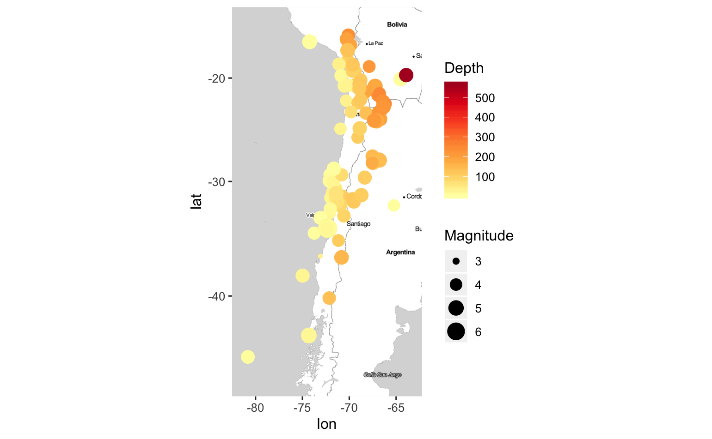

Dentro de los datos que se utilizaran para el análisis están: longitud, latitud, magnitud, profundidad, y tiempo.
Longitud y latitud son parte del sistema de coordenadas geográficas es un sistema que referencia cualquier punto de la superficie terrestre y que utiliza para ello dos coordenadas angulares, latitud (norte o sur) y longitud (este u oeste).
Magnitud es una medida que tiene relación con la cantidad de energía liberada en forma de ondas.
Profundad define la distancia entre el epicentro de un terremoto con respecto al nivel del mar.
Tiempo es el registro del evento.

El gráfico de abajo muestra la cantidad de reportes recolectados por año, dentro de las inferencias, y consultas hechas los outliers que puedan ser registrados con equipos antiguos están exentos por ser mínima en su cantidad.

```{r, message=FALSE, eval=FALSE}
# load libraries
library(tidyverse)
library(lubridate)

ggplot(season_data, mapping = aes(x=year)) +
  geom_bar()
```

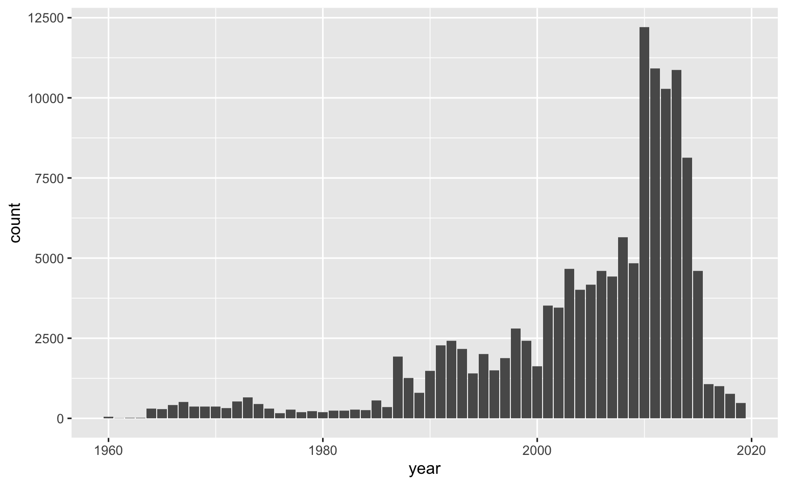

<!-- ## Datos de temperaturas (Borrar) -->

<!-- Los datos de temperaturas máximas, mínimas y medias fueron extraídos de la página del CR2, al igual que los datos de precipitaciones. -->
<!-- Por esto, tienen la misma clasificación que ellos. -->

## Datos de registros de ingresos hospitalarios


## Datos de enfermedades transmitidas por alimentos

Los datos de salud alimentaria fueron extraídos de la página web del Departamento de Estadísticas e Información de Salud, en www.deis.cl.
Se extrajeron datos de los brotes de enfermedades transmitidas por alimentos desde el año 2011 hasta el 2017, siendo estos todos los disponibles.

Para hacer una primera exploración de los resultados, se contó la cantidad de casos de enfermedades transmitidas por alimentos reportadas cada año para algunas regiones afectadas por terremotos grandes que ocurrieron en el periodo 2011-2017, aquellos de Iquique el año 2014 y de Illapel el año 2015.

Ahora, los sismos vienen con las columnas _Year_, _Month_ y _Day_, que fueron generados con una función similar a _agregarFechas_ que se encuentra en el anexo.
También incluyen las regiones: estas fueron generadas mediante la función *cargar_sismos_por_region* que se encuentra en el anexo.

### Análisis hitos anteriores

```{r, echo=FALSE, eval=FALSE}
# Agregarle las fechas a las ETAs
agregarFechasEtas <- function(dataframe) {
  fechas <- as.Date(dataframe$Fecha.de.Ingestión, "%d-%m-%Y")
  fechas <- data.frame(Year=as.numeric(format(fechas, format="%Y")),
                       Month=as.numeric(format(fechas, format="%m")),
                       Day=as.numeric(format(fechas, format="%d")))
  fecha_num <- data.frame(num_date=fechas$Year +
                            (fechas$Month-1)/12 +
                            (fechas$Day-1)/24/12)
  fechas <- cbind(fechas, fecha_num)
  cbind(dataframe, fechas)
}
```

Se cargan los sismos con:
```{r cargarSismos, eval=FALSE}
sismos <- read.delim("http://anakena.dcc.uchile.cl/~rllull/CC5206/sismos.csv",
                     header = TRUE, sep = ",", quote = "\"", dec = ".", fill = TRUE, comment.char = "#")
```

El código para las ETAs se simplificó mucho, logrando unir los 7 datasets de ETAs en 1.
De esta manera, se cargan los datos de la forma:

```{r cargarEtas, eval=FALSE}
# Carga de las ETAs
etas <- read.delim("http://anakena.dcc.uchile.cl/~rllull/CC5206/etas2011_2017.csv",
                   header = TRUE, sep = ",", quote = "\"", dec = ".", fill = TRUE, comment.char = "#")

# Agregarle las fechas a las ETAs
etas <- agregarFechasEtas(etas)
```

Después, se guardan los datos en data frames *cant_etas* y *cant_etas_deshidratacion*, para obtener algunos gráficos:

```{r graficosETAs, echo=FALSE}

cant_etas <- data.frame("Año"=etas$Año.estadistico, "Región"=etas$Región.de.consumo,
                        "Cantidad"=etas$Región.de.consumo)
cant_etas <- aggregate(Cantidad ~ Año + Región, cant_etas, function(a) {sum(a>0)})

library(ggplot2)  # cargamos la librería

par(mfrow=c(1, 3))
a <- ggplot(cant_etas[cant_etas$Región == 4, ]) + # asociamos un data frame a ggplot
  geom_bar(aes(x = Año, y = Cantidad), stat="identity") +   # creamos un grafico de barras como una capa
  #coord_flip() +  # transformamos el grafico invirtiendo los ejes de coordenadas (sólo visualmente)
  ggtitle("Reportes de ETA anuales\npara la Región de Coquimbo") + # título
  xlab("Año") + ylab("Cantidad de ETA")  # etiquetas

b <- ggplot(cant_etas[cant_etas$Región == 1, ]) + # asociamos un data frame a ggplot
  geom_bar(aes(x = Año, y = Cantidad), stat="identity") +   # creamos un grafico de barras como una capa
  #coord_flip() +  # transformamos el grafico invirtiendo los ejes de coordenadas (sólo visualmente)
  ggtitle("Reportes de ETA anuales\npara la Región de Tarapacá") + # título
  xlab("Año") + ylab("Cantidad de ETA")  # etiquetas

c <- ggplot(cant_etas[cant_etas$Región == 2, ]) + # asociamos un data frame a ggplot
  geom_bar(aes(x = Año, y = Cantidad), stat="identity") +   # creamos un grafico de barras como una capa
  #coord_flip() +  # transformamos el grafico invirtiendo los ejes de coordenadas (sólo visualmente)
  ggtitle("Reportes de ETA anuales\npara la Región de Antofagasta") + # título
  xlab("Año") + ylab("Cantidad de ETA")  # etiquetas

ggarrange(a, b, c,
                    ncol = 2, nrow = 2)


```

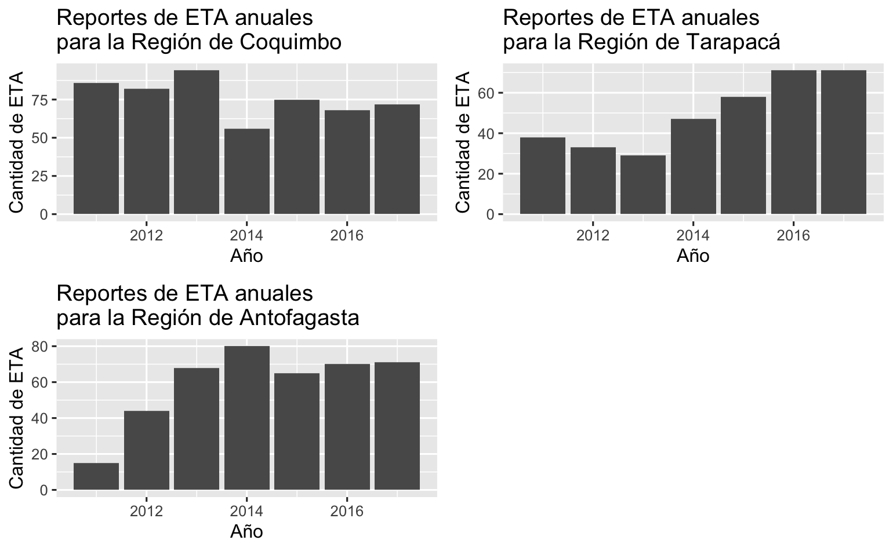

# Diseño experimental

Dentro del disenio experimental se inclino a realizar un analysis de clustering y clasificacion de sismos con respecto a eventos ETA y IH. Este necesito de un riguroso analysis de los datos para poder procesar y preparar la data. Dentro de los cambios mas fuertes fue el de la categorizacion de los datos sismos (datos geograficos) en regiones a Chile. Ademas del filtrado de los caracteristicas utiles para este analysis.

Se plantea una clasificacion de sismos binaria y otra de cuatro dimensiones de incrementos en ETA y IH. En cuanto a los clusterings se muestra la correlacion los sismos tienen con los incrementos de ETA y IH, asi encontrar una segementacion que nos ayude la relacion de estos fenomenos.

:TODO brief conclusion

## Limpieza de los datos

### Datos sismológicos

Los datos sismicos son la principal fuente de informacion para los experimentos. Este requirio de los siguiente pasos.

- Con el nuevo objetivo definido, se buscó encontrar la correlación que se produce entre los sismos los informes de ETA e IH. Para ello, se decidió utilizar solamente aquellos sismos de magnitud mayor o igual a 5 Mw (magnitud en la escala de Ritchter). 

- Se realizo la clasificacion regional de los datos filtrando sismos que pertenezcan a Chile, agregando una columna para agregar el nombre de la region correspondiente (el codigo se encuentra en anexos). 

- Se agrego datos en representacion de las fechas para facilitar las consultas a la data. 

- Por ultimo se filtro aquellas columnas que si representaban un verdadero aporte para los casos de estudio.

_Nota_. Lo anterior mensionado es suficiente para poder utilizar los datos, sin embargo estos no son suficientes como veremos mas adelante. Por ejemplo, es necesario escalar los datos para el clustering y clasificacion. Ademas los datos satelite (ETA e IH) obligan que existan ciertas restricciones en cada analysis.

### Aumento registrado según la región

Procedemos a hacer un _aggregate_ con tal de contar cuánto aumentó, en promedio, por cada magnitud y por cada región.
Además, se puede extraer si se aprecia un aumento según cada magnitud y cada intervalo, obteniendo un resultado en cantidad de ETAs registradas posteriores o anteriores al sismo en promedio.

```{r, message=FALSE, eval=FALSE}
mean <- function(a) {sum(a)/length(a)}

# Magnitud 5 o más
(agg_5_7d <- aggregate(Aumento ~ Region, mag5_7d, FUN=mean))

# Magnitud 6 o más
(agg_6_7d <- aggregate(Aumento ~ Region, mag6_7d, FUN=mean))

# Magnitud 7 o más
(agg_7_7d <- aggregate(Aumento ~ Region, mag7_7d, FUN=mean))

```

Se aprecia que en general en promedio se registran aumentos en los reportes de ETAs para cada región.
En la parte de Minería de datos se estudia con mayor detalle este hallazgo.


### Procesamiento de datos para clasificacion (agregacion)
Para generar correctamente un modelo de clasificación, se necesitó pensar en un procedimiento efectivo que dijera con certeza si un terremoto realmente provocó daños.
Esto, con base en la hipótesis de que mientras más daños pueda generar un sismo, más informes por ETAs se generan.
Además, se debió agregar la dimensión de temporalidad, necesaria para apreciar los datos.

De esta manera, se pensó en lo siguiente: si en los _n_ días antes del sismo se registraron menos informes por ETA que en los _n_ días después, quiere decir que el sismo aumentó los informes y por ende los daños.
De lo contrario, los disminuyó.
Este valor se denominó Δ, con $\Delta = etas_{post} - etas_{ant}$.

En el Hito 2 se representó con un 1 si el Δ era positivo, y un 0 si era negativo.
El nuevo Δ permitió aumentar la cantidad de clases a estudiar.

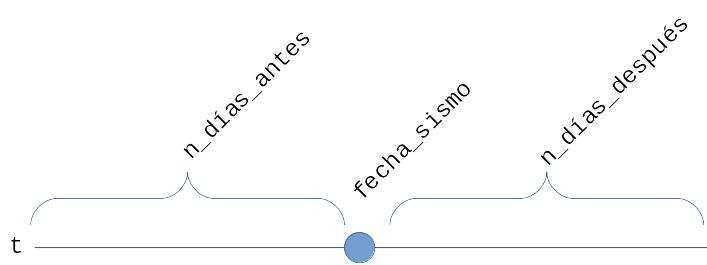

Se extraen para diferentes magnitudes (5, 6 y 7) e intervalos (de 3, 7, 14 y 30 días).
Se crea una función para trabajar los datos más fácil.

```{r, eval=FALSE}
generar_datos <- function(sismos, etas, magnitud_min, dias, escribir=TRUE) {
  sismos_mag <- sismos[sismos$Magnitude >= magnitud_min
                       & sismos$Year >= 2011 & sismos$Year <= 2017, ]
  # Generar los dataframes
  # datos es para trabajarlo en el árbol de decisión
  datos <- data.frame(Magnitud = rep(0, nrow(sismos_mag)),
                      Profundidad = rep(0, nrow(sismos_mag)),
                      Region = rep(0, nrow(sismos_mag)),
                      Aumento = rep(0, nrow(sismos_mag)))
  # datos_con_fecha es para trabajarlo en lo que viene
  datos_con_fecha <- data.frame(datos,
                              Año = rep(0, nrow(sismos_mag)),
                              Mes = rep(0, nrow(sismos_mag)))
  for (i in 1:nrow(sismos_mag)) {
    sismo <- sismos_mag[i, ]
    # Tomar los dias días anteriores
    etas_ant <- etas[sismo$num_date - dias/30/12 <= etas$num_date
                     & etas$num_date <= sismo$num_date, ]
    # Tomar los 7 días posteriores
    etas_post <- etas[sismo$num_date < etas$num_date
                      & etas$num_date <= sismo$num_date + dias/30/12, ]
    # La diferencia es la cantidad de columnas de las posteriores menos las anteriores
    dif <- nrow(etas_post) - nrow(etas_ant)
    
    # Asignar los valores a los datos
    datos[i, ]$Magnitud <- sismo$Magnitude
    datos[i, ]$Profundidad <- sismo$Depth
    datos[i, ]$Region <- sismo$Region_Number
    # A diferencia del Hito 2, se guarda el Δ completo
    datos[i, ]$Aumento <- dif
    # Guardar datos a retornar
    datos_con_fecha[i, ] <- datos[i, ]
    datos_con_fecha[i, ]$Año <- sismo$Year
    datos_con_fecha[i, ]$Mes <- sismo$Month
    
  }
  # Escribir el csv con los datos obtenidos
  if (escribir) {
    nombre_archivo <- paste("datos_mag", magnitud_min, "_", dias, "d.csv", sep="", collapse=NULL)
    write.csv(datos, nombre_archivo, row.names=FALSE)
  }
  (datos_con_fecha)
}
```

Para generar los datos, se procedió de la siguiente forma:

```{r, eval=FALSE}
# Sismos de magnitud mayor o igual a 5
mag5_3d <- generar_datos(sismos, etas, 5, 3)
mag5_7d <- generar_datos(sismos, etas, 5, 7)
mag5_14d <- generar_datos(sismos, etas, 5, 14)
mag5_30d <- generar_datos(sismos, etas, 5, 30)

# Sismos de magnitud mayor o igual a 6
mag6_3d <- generar_datos(sismos, etas, 6, 3)
mag6_7d <- generar_datos(sismos, etas, 6, 7)
mag6_14d <- generar_datos(sismos, etas, 6, 14)
mag6_30d <- generar_datos(sismos, etas, 6, 30)

# Sismos de magnitud mayor o igual a 7
mag7_3d <- generar_datos(sismos, etas, 7, 3)
mag7_7d <- generar_datos(sismos, etas, 7, 7)
mag7_14d <- generar_datos(sismos, etas, 7, 14)
mag7_30d <- generar_datos(sismos, etas, 7, 30)
```


# Clustering

## Clustering ETA
### Análisis del aumento con boxplot

Se puede estudiar el balance de los datos por cada magnitud según la cantidad de días de intervalo tomados.
Del resultado anterior se sugiere un aumento en la cantidad de ETAs registradas según la cantidad de días de intervalo considerados para los sismos.

```{r, eval=FALSE}
par(mfrow=c(1, 3))

outl_mag5 <- boxplot(mag5_3d$Aumento, mag5_7d$Aumento, mag5_14d$Aumento, mag5_30d$Aumento, main="Aumento para magnitud >= 5\ny 3, 7, 14 y 30 días de intervalo")$out
lines(x=c(0, 5), y=rep(0, 2), col="red", lwd=2)

outl_mag6 <- boxplot(mag6_3d$Aumento, mag6_7d$Aumento, mag6_14d$Aumento, mag6_30d$Aumento, main="Aumento para magnitud >= 6\ny 3, 7, 14 y 30 días de intervalo")$out
lines(x=c(0, 5), y=rep(0, 2), col="red", lwd=2)

outl_mag7 <- boxplot(mag7_3d$Aumento, mag7_7d$Aumento, mag7_14d$Aumento, mag7_30d$Aumento, main="Aumento para magnitud >= 7\ny 3, 7, 14 y 30 días de intervalo")$out
lines(x=c(0, 5), y=rep(0, 2), col="red", lwd=2)
```
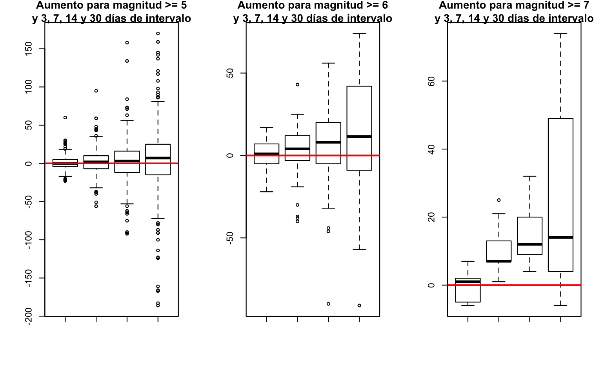

Se ve que los datos para 30 días tienen mucha dispersión, y aquellos para 3 días están muy centrados al 0.
Se aprecia además que hay muchos outliers por lo que se remueven para realizar el _clustering_.

```{r, eval=FALSE}
mag5_7d_sinout <- mag5_7d[-which(mag5_7d$Aumento %in% outl_mag5), ]
mag5_14d_sinout <- mag5_14d[-which(mag5_14d$Aumento %in% outl_mag5), ]

mag6_7d_sinout <- mag6_7d[-which(mag6_7d$Aumento %in% outl_mag6), ]
mag6_14d_sinout <- mag6_14d[-which(mag6_14d$Aumento %in% outl_mag6), ]

mag7_7d_sinout <- mag7_7d[-which(mag7_7d$Aumento %in% outl_mag7), ]
mag7_14d_sinout <- mag7_14d[-which(mag7_14d$Aumento %in% outl_mag7), ]

par(mfrow=c(1, 3))

boxplot(mag5_7d_sinout$Aumento, mag5_14d_sinout$Aumento, main="Aumento para magnitud >= 5\ny 7 y 14 días sin outliers")
lines(x=c(0, 5), y=rep(0, 2), col="red", lwd=2)

boxplot(mag6_7d_sinout$Aumento, mag6_14d_sinout$Aumento, main="Aumento para magnitud >= 6\ny 7 y 14 días sin outliers")
lines(x=c(0, 5), y=rep(0, 2), col="red", lwd=2)

boxplot(mag7_7d_sinout$Aumento, mag7_14d_sinout$Aumento, main="Aumento para magnitud >= 7\ny 7 y 14 días sin outliers")
lines(x=c(0, 5), y=rep(0, 2), col="red", lwd=2)
```
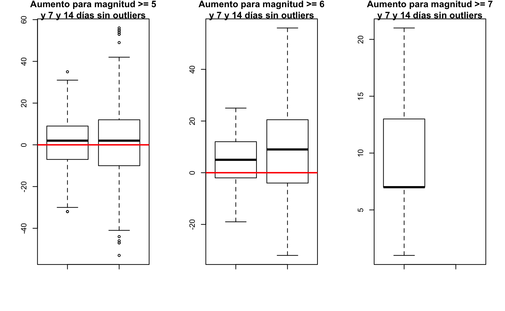

### Generación de los clusters con K-Means

Como se vio en la sección anterior, se aprecia que los datos están cargados hacia el positivo, es decir, hacia el aumento de los reportes de ETAs.

Dados los hallazgos encontrados en el preprocesamiento y la limpieza de datos, se procedió a realizar un _clustering_ mediante el método de K-Means sobre los datos.
El objetivo es averiguar si existen grupos de sismos que permitan predecir aumentos o disminuciones de reportes.

Se procede a trabajar para 7 y 14 días puesto que para estos valores se encontraron mejores resultados en la iteración anterior, y porque para los datos de 30 días la dispersión encontrada es muy amplia.

Generación de los datos:

```{r, eval=FALSE}
generar_datos_cluster <- function(datos) {
  x <- data.frame(
    Magnitud = datos$Magnitud,
    Profundidad = datos$Profundidad,
    Region = datos$Region,
    Aumento = datos$Aumento
  )
  (scale(x))
}

x1 <- generar_datos_cluster(mag5_7d_sinout)
x2 <- generar_datos_cluster(mag5_14d_sinout)
x3 <- generar_datos_cluster(mag6_7d_sinout)
x4 <- generar_datos_cluster(mag6_14d_sinout)
x5 <- generar_datos_cluster(mag7_7d)
x6 <- generar_datos_cluster(mag7_14d)

```

Vemos la cantidad de _clusters_ según el método del codo.
Puesto que los datos de magnitud mayor o igual a 6 incluyen a los de 5, se procede con 5, a 7 días:

```{r, eval=FALSE}
elbow_fun <- function (data) {
  wss <- 0
  for (i in 1:clust){
    wss[i] <- sum(kmeans(data, centers=i)$withinss)
  }
  wss
}


# Método del codo para 15 clusters, sobre el dataset para magnitud 6 y 7 días de intervalo
clust <- 15

wss1 <- elbow_fun(x1)

plot(1:clust, wss1, type="b", main="Codo para mag. 5, 7d.", xlab="Nº de clusters", ylab="wss")
```
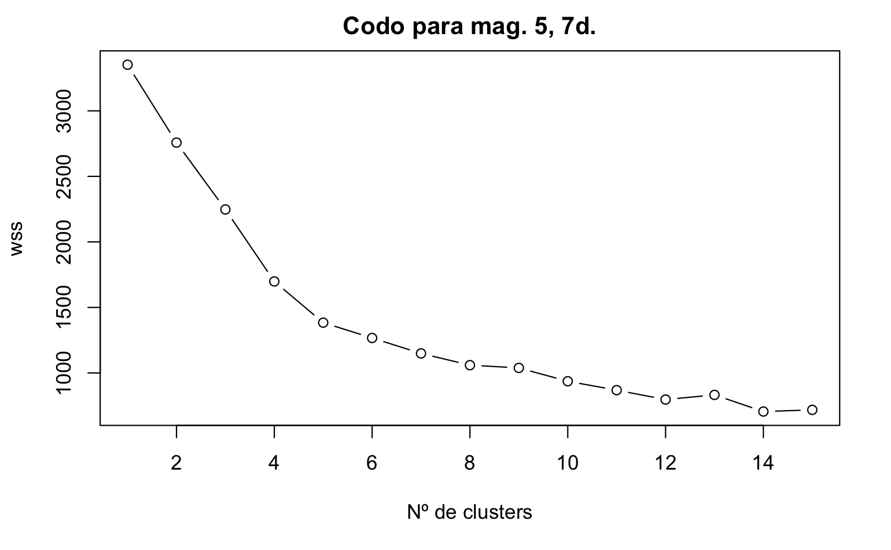

Se aprecia que el codo está en torno a los 5 clusters.

Se procede a realizar los clusters con K-Means.
Para ello se ejecuta el siguiente _script_:

```{r}
set.seed(3)
cant_clusters <- 5
ns <- 20

km.out1 <- kmeans(x1, cant_clusters, nstart=ns)
km.out2 <- kmeans(x2, cant_clusters, nstart=ns)
km.out3 <- kmeans(x3, cant_clusters, nstart=ns)
km.out4 <- kmeans(x4, cant_clusters, nstart=ns)
km.out5 <- kmeans(x5, cant_clusters, nstart=ns)
km.out6 <- kmeans(x6, cant_clusters, nstart=ns)

pairs(x1, col=km.out1$cluster, pch=8, main="Clustering para magnitud 5 y 7 días")
pairs(x2, col=km.out2$cluster, pch=8, main="Clustering para magnitud 5 y 14 días")
pairs(x3, col=km.out3$cluster, pch=8, main="Clustering para magnitud 6 y 7 días")
pairs(x4, col=km.out4$cluster, pch=8, main="Clustering para magnitud 6 y 14 días")
pairs(x5, col=km.out5$cluster, pch=8, main="Clustering para magnitud 7 y 7 días")
pairs(x6, col=km.out6$cluster, pch=8, main="Clustering para magnitud 7 y 14 días")
```

Se observa que para la región, no se encuentran clusters claros.
La suposición hecha en el hito anterior de no utilizar la región para clasificar parece haber sido acertada.
Se observa que para magnitud y profundidad, para las magnitudes 5 y 6 e intervalo de 7 y 14 días, se forman algunos grupos en que los ETAs aumentan y otros en que disminuyen.

Se podría decir que estos grupos sufren una especie de contrarrestación mutua, siendo el _cluster_ con aumentos más claros el de color rojo generado para la magnitud 6, a 7 días de intervalo en la columna de Profundidad, y el color negro en la columna de Magnitud.


# Clasificacion
<!-- ### Arboles de Decision ETA -->

<!-- El experimento consistió en generar un GridSearchCV de DecisionTree para criterios criterion gini y entropy, mientras que con una profundidad máxima de entre 1, 3 y 5 para los árboles generados. -->

<!-- Esto se realizó en Python 3 mediante la librería `sklearn`. -->
<!-- Se generaron archivos de texto que almacenaran los resultados para los distintos árboles. -->


## Clasificadores de enfermedades de transmisión alimentaria

De acuerdo a lo observado en la sección anterior, se justifica realizar un clasificador, debido a que se logran apreciar algunos _clusters_ relacionados con la profundidad y la magnitud del sismo y el aumento de los ingresos por enfermedades de transmisión alimentaria.
Además, se observó que con sismos mayores o iguales a magnitud 6, los ingresos aumentaban y se mantenían en un valor positivo de diferencia respecto a la cantidad posterior al sismo y anterior a él.
Con los magnitud 7 se observó un aumento de los ingresos post sismo siempre.

Para realizar una correcta clasificación, se sugirieron dos conjuntos de clases en base a la cantidad de «Aumento» planteado en las secciones anteriores.

##### 2 clases: aumento o disminución

Clasificador binario. Debe predecir si un sismo produciría aumento en los ingresos o disminución, considerando el 0 como disminución.

Se clasifica de tal forma que si la columna «Aumento» es menor a 0, significa que disminuyó y, si no, aumentó.
 
##### 4 clases: aumento/disminución alto/bajo.

Se establece una graduación a la cantidad de aumento, de tal forma que se distinga entre un aumento (o disminución) grande o bajo. Se justifica por los resultados del _cluster_.

Se considera bajo si el aumento o la disminución es menor a 12 (mayor a -12 en caso de ser disminución), mientras que alto en caso contrario.

En resumen, la clasificación queda como:
  - Aumento < -12: disminución alta
  - Aumento <= 0: disminución baja
  - Aumento <= 12: aumento alto
  - Caso contrario: aumento alto


La razón de clasificar con mayor cantidad de clases es despegarse de posibles variaciones no significativas, en este caso consideradas como variaciones menores a 12 ingresos pre y post sismo.
De esta manera, se podría decidir de mejor forma si un sismo incide o no en la cantidad de ingresos post sismo.
Además, el _cluster_ arrojó al menos 4 tipos de sismos distintos, dos distinguibles entre aumento y disminución y dos que no tendrían relación con el aumento.

En la siguiente sección se explica por qué se escogió 12 como umbral.

### Determinación del umbral para clasificador de ETAs

Para el nuevo clasificador, fue necesario determinar un umbral con tal de definir la disminución marcada, la disminución tenue, el aumento tenue y el aumento marcado.

Se cargan los datos con la función *generar_datos*, de la forma
```{r}
mag4_7d <- generar_datos(sismos, etas, 4, 7, escribir=FALSE)
```

Luego se determinó el número para el umbral observando el comportamiento parecido a una distribución normal observado para los datos de magnitud 5
```{r}
quantile(mag4_7d$Aumento, prob=seq(0, 1, length = 11))
```


### Evaluación de la influencia de la región o no

Como hipótesis, se plantea que la región no debería influir en los resultados de la clasificación.
Sin embargo, dado que en el norte se tienen más datos que en el sur de Chile (han habido más sismos y, por consiguiente, más sismos de magnitud mayor a 5), podría observarse una diferencia en las observaciones.
Por esto, se realizaron experimentos de clasificación considerando las regiones y sin considerarlas.

### Clasificador de árbol de decisión

Se decidió evaluar el desempeño de un árbol de decisión, con el que se intentaría predecir el impacto de los terremotos.
Para poder observar las decisiones que va considerando el árbol de decisión, se buscó una forma de imprimir gráficamente el árbol, mostrando la iportancia de cada atributo.

Se eligió un árbol de decisión, debido a que las hojas pueden estar en diferentes grupos, sin importar la cantidad que el grupo tenga.
Así, podría adaptarse a los distintos sismos.


#### Competencia de árboles de decisión

Cómo los resultados variaban dependiendo la profundidad con la que se formaban los árboles, se decidió hacerlos competir variando los parámetros profundidad máxima y criterion.

### Competencia de clasificadores

Como el árbol no arrojó buenos resultados, como se muestra en la sección de resultados, se decidió probar otro tipo de clasificadores.
Algunos, podrían ser más parecidos a los que se apreció en los _clusters_, como el KNN.
Sin embargo, se decidió que no se limitaría a investigar el comportamiento de ese solamente, por lo que también se optó por usar un clasificador bayesiano y uno «dummy» que sería bueno para comparar el correcto entrenamiento de los clasificadores.

## Cambio en la forma de medir los ingresos hospitalarios

### Experimentación con los clasificadores expuestos anteriormente

### Ingresos hospitalarios


# Resultados

## Clasificador para enfermedades de transmisión alimentaria

### Resultados clasificador de árbol de decisión

Las siguientes librerías son necesarias para ejecutar los scripts:
```{python}
import numpy as np
import pandas as pd

from sklearn.tree import DecisionTreeClassifier
from sklearn.metrics import accuracy_score
from sklearn.metrics import classification_report
from sklearn.model_selection import train_test_split
from sklearn.model_selection import GridSearchCV

# Imports para el exportador de árbol
from sklearn.externals.six import StringIO
from IPython.display import Image
from sklearn.tree import export_graphviz
from sklearn import tree
import pydotplus

# Directorio donde están los datos para el clasificador
datos_dir= "Diferencia ETAs por magnitud/"
```


  
#### Clasificador binario

Este es el clasificador que se usó para las clases de «Aumento» o «Disminución».

```{python}
def exportTreeImage(dtree, X, y, path):
    # Create dot data
    dot_data = tree.export_graphviz(dtree, out_file=None,
            filled=True,
            rounded=True, special_characters=True,
            feature_names=X.columns.tolist(),
            class_names=['Disminución', 'Aumento'])

    # Draw graph
    graph = pydotplus.graph_from_dot_data(dot_data)

    # Show graph
    Image(graph.create_png())

    # Create PNG
    graph.write_png(path)
    

def entrenarClasificador(prueba, path_X, path_y):
    print("########## Inicio de entrenamiento ###########")
    print(type(prueba))
    print("Leyendo archivo " + path_X)
    X= pd.read_csv(path_X);
    print("Success")
    print("Leyendo archivo " + path_y)
    y= pd.read_csv(path_y);
    print("Success")
    
    X_train, X_test, y_train, y_test = train_test_split(X, y, test_size=.33, random_state=9, stratify=y)

    clf= DecisionTreeClassifier(max_depth=5)
    clf.fit(X_train, y_train)

    y_pred= clf.predict(X_test)

    print("Accuracy en test set:", accuracy_score(y_test, y_pred))
    print(classification_report(y_test, y_pred))

    print("########### Fin de entrenamiento #############") 
    print("##############################################")

    return clf, X, y, X_train, y_train, X_test, y_test


def main():

    pruebas= ["5_7d", "6_7d", "7_7d", "5_14d", "5_7d_desh"]
    
    for p in pruebas:
    
        clf, X, y, X_train, y_train, X_test, y_test = entrenarClasificador(p,
                                                datos_dir + "X" + p + ".csv",
                                                datos_dir + "y" + p + ".csv")

        # Exportar árbol
        #exportTreeImage(clf, X, y, p + "binario.png")
main()
```


#### Clasificador de 4 clases

Este es el clasificador utilizado para las clases de Aumento/Disminución Alta/Baja.
```{python}
def exportTreeImage(dtree, X, y, path):
    # Create dot data
    dot_data = tree.export_graphviz(dtree, out_file=None,
            filled=True,
            rounded=True, special_characters=True,
            feature_names=X.columns.tolist(),
            class_names=['Alta_Dism.', 'Baja_Dism.','Bajo_Aum.', 'Alto_Aum.'])

    # Draw graph
    graph = pydotplus.graph_from_dot_data(dot_data)

    # Show graph
    Image(graph.create_png())

    # Create PNG
    graph.write_png(path)
    

def entrenarClasificador(prueba, path_X, path_y):
    print("##############################################")
    print("########## Inicio de entrenamiento ###########")
    print(type(prueba))
    print("Leyendo archivo " + path_X)
    X= pd.read_csv(path_X);
    print("Success")
    print("Leyendo archivo " + path_y)
    y= pd.read_csv(path_y);
    print("Success")
    
    X_train, X_test, y_train, y_test = train_test_split(X, y, test_size=.33, random_state=9, stratify=y)

    clf= DecisionTreeClassifier(max_depth=5)
    clf.fit(X_train, y_train)

    y_pred= clf.predict(X_test)

    print("Accuracy en test set:", accuracy_score(y_test, y_pred))
    print(classification_report(y_test, y_pred))

    print("########### Fin de entrenamiento #############") 
    print("##############################################")

    return clf, X, y, X_train, y_train, X_test, y_test


def main():

    pruebas= ["5_7d", "5_14d", "6_7d", "6_14d", "7_7d", "7_14d"]

    for p in pruebas:
    
        print("##########################################")
        print("Clasificador con región")
        clf, X, y, X_train, y_train, X_test, y_test = entrenarClasificador(p,
                                                datos_dir + "X" + p + ".csv",
                                                datos_dir + "y" + p + "_cat.csv")

        # Exportar árbol
        #exportTreeImage(clf, X, y, p + ".png")

        print("##########################################")
        print("Clasificador sin región")
        clf, X, y, X_train, y_train, X_test, y_test = entrenarClasificador(p,
                                                datos_dir + "X" + p + "_sin_reg.csv",
                                                datos_dir + "y" + p + "_cat.csv")
        #exportTreeImage(clf, X, y, p + "sin_reg.png")
        
main()
```


Los resultados gráficos de los árboles presentados son los que se presentan a continuación.
Se mostrarán solo algunos, pero los demás pueden verse en la carpeta «Diferencia ETAs por magnitud».

Aquí se pueden observar los resultdos distintos de árboles que se obtuvieron para los 14 días, con magnitudes de sismo mayores o iguales a 5.
Se tienen muestras con los datos sin considerar las regiones, considerándolas y con 4 y 2 clases.

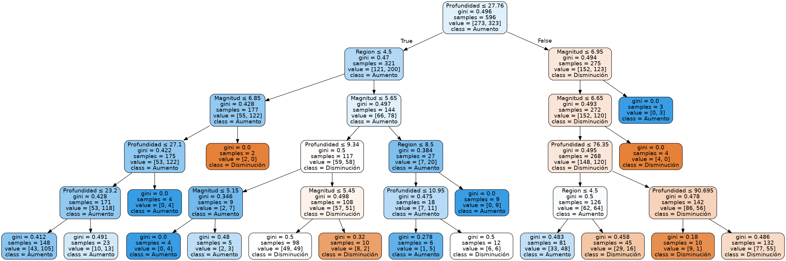

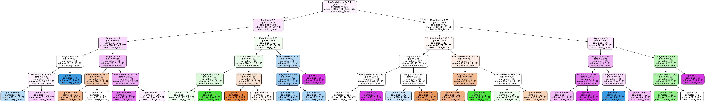

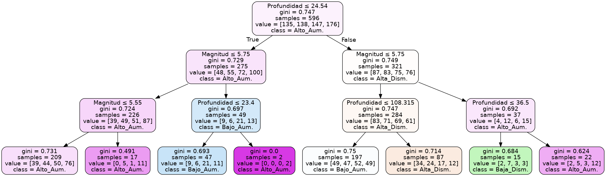

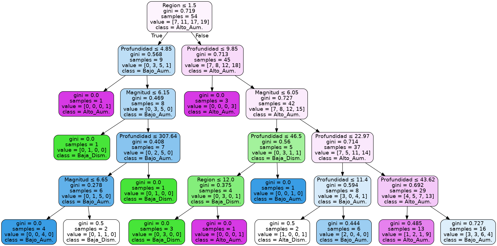

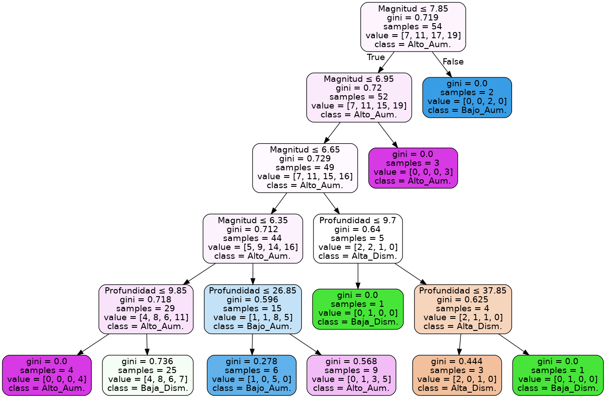


Como norma general, se puede apreciar que las regiones se presentan muy arriba en el árbol.
Es decir, se llevan la mayor cantidad del peso de las decisiones que este toma.
Esto puede deberse a que la mayor cantidad de sismos de los que se tiene registro pueden alterar los resultados.
El caso extremo fue analizar los sismo de magnitud mayor o igual a 7, en los cuales la región fue el único parámetro utilizado para clasificar los sismos.
Por esta razón, se decidió corroborar la información con los mismos datos, pero sin considerar las regiones.

Sin las regiones, se obtuvieron árboles más pequeños en general, lo que habla también de una posible mejoría respecto a evitar sobreajustes.

A pesar de esto, como muestran los resultados de arriba, el árbol es bastante malo para encontrar las clases, en todos los casos.
El accuracy y el recall son muy bajos para ser considerado un clasificador efectivo.

Se observa que la decisión de aumentar la cantidad de clases disminuyó el accuracy y el recall, por lo que no fue una medida efectiva.

El mejor de todos fue el clasificador que usó los datos de magnitud 6 para 7 días binario, como en el hito anterior.


### Resultados de la competencia de clasificadores

Se tomaron magnitudes distintas para evaluar los clasificadores: 5, 6, y 7, de 14 días todos, que fueron los que tuvieron mejor capacidad predictiva según los resultados anteriores.

Además, se realizó competencia para aquellos binarios (con dos clases) y los con 4 clases.
El código se encuentra en los anexos.

#### Binarios
##### Magnitud 5, 14 días
----------------

Resultados para clasificador:  Base Dummy

Precision promedio: 0.5057435931464518

Recall promedio: 0.5035205992509363
  
F1-score promedio: 0.5032128058844465

----------------

----------------

Resultados para clasificador:  Decision Tree

Precision promedio: 0.5372547395781313

Recall promedio: 0.5334831460674156

F1-score promedio: 0.5334884367150398

----------------

----------------

Resultados para clasificador:  Gaussian Naive Bayes

Precision promedio: 0.5778510470900172

Recall promedio: 0.5755430711610486

F1-score promedio: 0.565797022911816

----------------

----------------

Resultados para clasificador:  KNN

Precision promedio: 0.5358593799236964

Recall promedio: 0.5362921348314607

F1-score promedio: 0.5345539655623789

----------------

#### Con 4 clases

##### Magnitud 5, 14 días

---------------- 

Resultados para clasificador:  Base Dummy 

Precision promedio: 0.2543251271511943 

Recall promedio: 0.25168539325842704 

F1-score promedio: 0.2513672342633679 

---------------- 
 
----------------

Resultados para clasificador:  Decision Tree 

Precision promedio: 0.28198277519152576 

Recall promedio: 0.2779026217228464 

F1-score promedio: 0.277833332404425 

----------------

----------------

Resultados para clasificador:  Gaussian Naive Bayes

Precision promedio: 0.28500778188199705

Recall promedio: 0.3156554307116105

F1-score promedio: 0.2559771146372389

----------------

----------------

Resultados para clasificador:  KNN

Precision promedio: 0.29402535668893387

Recall promedio: 0.2847191011235955

F1-score promedio: 0.28464672910000527

----------------


##### Magnitud 6, 14 días
----------------

Resultados para clasificador:  Base Dummy

Precision promedio: 0.31734917970917964

Recall promedio: 0.2912

F1-score promedio: 0.28493039675184

----------------

----------------

Resultados para clasificador:  Decision Tree

Precision promedio: 0.29914288933288935

Recall promedio: 0.2716

F1-score promedio: 0.26893306454700533

----------------

---------------- 

Resultados para clasificador:  Gaussian Naive Bayes 

Precision promedio: 0.2681247261059187

Recall promedio: 0.28519999999999995

F1-score promedio: 0.23373182632714543

----------------

----------------

Resultados para clasificador:  KNN

Precision promedio: 0.220177534337008

Recall promedio: 0.18959999999999996

F1-score promedio: 0.1826686267078818

----------------

##### Magnitud 7, 14 días

---------------- 

Resultados para clasificador:  Base Dummy 

Precision promedio: 0.5138888888888888 

Recall promedio: 0.43000000000000005 

F1-score promedio: 0.41966666666666663 

---------------- 
 
----------------

Resultados para clasificador:  Decision Tree 

Precision promedio: 0.8622222222222221 

Recall promedio: 0.8433333333333333 

F1-score promedio: 0.8326666666666666 

----------------

----------------

Resultados para clasificador:  Gaussian Naive Bayes

Precision promedio: 0.6283333333333334

Recall promedio: 0.6366666666666667

F1-score promedio: 0.6016666666666667

----------------

----------------

Resultados para clasificador:  KNN

Precision promedio: 0.4461111111111111

Recall promedio: 0.5033333333333333

F1-score promedio: 0.43833333333333324

----------------


Se observa que, en general, todos los clasificadores se asemejan al clasificador Dummy en los resultados.
Se concluye, entonces que los clasificadores no fueron una buena herramienta, probablemente debido a la falta de datos (en general fueron pocos, por la falta de sismos fuertes) o a distintos comportamientos entre regiones.
En este sentido, para el futuro podrían aislarse las regiones y probar por cada una de ellas, para que el clasificador se «adapte» a su región en particular.

## Clasificador para ingresos hospitalarios


# Anexo

```{r agregarFechas}
# Agregarle las fechas a las ETAs
agregarFechasEtas <- function(dataframe) {
  fechas <- as.Date(dataframe$Fecha.de.Ingestión, "%d-%m-%Y")
  fechas <- data.frame(Year=as.numeric(format(fechas, format="%Y")),
                       Month=as.numeric(format(fechas, format="%m")),
                       Day=as.numeric(format(fechas, format="%d")))
  fecha_num <- data.frame(num_date=fechas$Year +
                            (fechas$Month-1)/12 +
                            (fechas$Day-1)/24/12)
  fechas <- cbind(fechas, fecha_num)
  cbind(dataframe, fechas)
}
```


```{python}
#################################
# Competencia de clasificadores #
#################################
import numpy as np
from sklearn.model_selection import train_test_split
from sklearn.metrics import f1_score, recall_score, precision_score


def run_classifier(clf, X, y, num_tests=100):
    metrics = {'f1-score': [], 'precision': [], 'recall': []}
    

    
    for _ in range(num_tests):
        X_train, X_test, y_train, y_test = train_test_split(X, y, test_size=.30)
        
        clf.fit(X_train, y_train)
        
        predictions = clf.predict(X_test)
        
        metrics['y_pred'] = predictions
        metrics['y_prob'] = clf.predict_proba(X_test)[:,1]
        metrics['f1-score'].append(f1_score(y_test, predictions, average='weighted')) 
        metrics['recall'].append(recall_score(y_test, predictions, average='weighted'))
        metrics['precision'].append(precision_score(y_test, predictions, average='weighted'))
    
    return metrics

import pandas as pd

from sklearn.dummy import DummyClassifier
from sklearn.svm import SVC  # support vector machine classifier
from sklearn.tree import DecisionTreeClassifier
from sklearn.naive_bayes import GaussianNB  # naive bayes
from sklearn.neighbors import KNeighborsClassifier


path_X = datos_dir + "X7_14d.csv"
path_y = datos_dir + "y7_14d_cat.csv"

print("Leyendo archivo " + path_X)
X= pd.read_csv(path_X);
print("Success")
print("Leyendo archivo " + path_y)
y= pd.read_csv(path_y);
print("Success")

c0 = ("Base Dummy", DummyClassifier(strategy='stratified'))
c1 = ("Decision Tree", DecisionTreeClassifier())
c2 = ("Gaussian Naive Bayes", GaussianNB())
c3 = ("KNN", KNeighborsClassifier(n_neighbors=5))

classifiers = [c0,c1, c2, c3]

results = {}
for name, clf in classifiers:
    metrics = run_classifier(clf, X, y)   # hay que implementarla en el bloque anterior.
    results[name] = metrics
    print("----------------")
    print("Resultados para clasificador: ",name) 
    print("Precision promedio:",np.array(metrics['precision']).mean())
    print("Recall promedio:",np.array(metrics['recall']).mean())
    print("F1-score promedio:",np.array(metrics['f1-score']).mean())
    print("----------------\n\n")
```


### Sismos por estaciones del año 

La siguiente es una gráfica de sismos a través de las estaciones del año tomando en cuenta datos desde el año 1960 hasta el 2019. La grafica muestra que existe una aparente correlacion entre las temporadas del año y la cantidad de terremotos.

```{r, eval=FALSE, message=FALSE, echo=FALSE}
# load libraries
library(tidyverse)
library(lubridate)

# create new columns 
dtime = as.Date(data$Time)
season_data <-  mutate(data,
  year = year(dtime),
  month = month(dtime),
  mday = mday(dtime)
)

# consider the limitation of seasons simply by looking into range of values
# we bound the seasons by month value, 
# we round the days of the season boundary. E.g. Sept 21 -> OCT

season_data <- mutate(season_data,
  season = case_when (
      month >= 4 & month <= 6 ~ "otonio",
      month >= 7 & month <= 9 ~ "invierno",
      month >= 10 & month <= 12 ~ "primavera",
      month >= 1 & month <= 3 ~ "verano"
    )
) 

# install if needed ggpubr
#install.packages("ggpubr")
library(ggpubr)
par(mfrow=c(2,1))

bplot <- season_data %>% 
  # filter(year > 2010) %>% 
  ggplot(mapping = aes(x=season)) + 
  geom_bar()

dplot <- season_data %>% 
  group_by(season) %>% 
  summarise(total = n()) %>% 
  ggplot(mapping = aes(x=season, y=total)) +
  geom_point() 

ggarrange(bplot, dplot,
                    ncol = 2, nrow = 1)

```
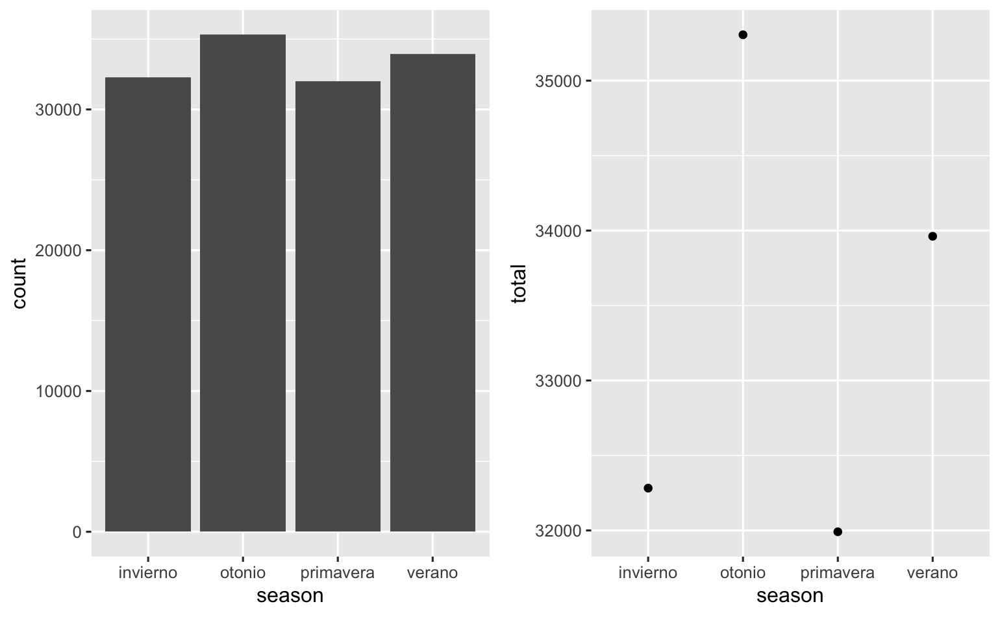

## Datos de precipitaciones fluviales

Los datos fluviales fueron extraídos de la página web de CR2. Fueron tomados desde enero de 1900 hasta febrero de 2018, en 874 estaciones de todo Chile. Existen 2 variantes: la resolución temporal mensual o diaria. Las precipitaciones están medidas en milímetros. A continuacion se muestra las caracteristicas del dataset, y el tratamiento y limpieza de los datos.

Las dimensiones del dataset corresponden a 874 filas y 1431 columnas, correspondientes a los datos obtenidos en todos los años desde 1900 a 2018, por cada estación. Además, presentan datos como la latitud y longitud de la estación, la altura a la que se encuentra sobre el nivel del mar y la cuenca a la que pertenecen.

Este dataset se dejó de usar para el Hito 3, porque en las iteraciones anteriores no se encontraron correlaciones entre los sismos y las lluvias, por lo que no resultó relevante utilizar técnicas de minería de datos para revisar estos dataset.

```{r, eval=FALSE}
# Importar dataset de lluvias mensuales
prAmon <- t(read.csv("https://anakena.dcc.uchile.cl/~cllull/IntroMineriaDatos/DataSets/cr2_prAmon_2018/cr2_prAmon_2018.txt"))

colnames(prAmon) <- as.character(unlist(prAmon[1, ])) # Le pone nombre a las columnas
prAmon <- prAmon[-1, ] # Extrae los datos

prAmon_na <- prAmon # Copia de prAmon
prAmon_na[prAmon == -9999] <- NA # Todas las celdas con -9999 a NA
```

Se deben declarar como NA los datos con -9999 que representan datos faltantes, para que R los trabaje de buena manera.

Luego se aplica el promedio de todos los años desde 1900 a 2018, evitando los NA.
```{r, eval=FALSE}
library(dplyr)
data <- prAmon_na[, 15:1431]  # Los datos de lluvia, sin descripción
data <- as.data.frame(data)  # De matrix a data.frame
data[,] <- apply(data[,], 2, function(x) as.numeric(x)) # Valores de character a numeric
prAmonMean <- prAmon_na[, 1:14]  # Tabla para poner el promedio
prAmonMean <- as.data.frame(prAmonMean)  # De matrix a data.frame
mean <- rowMeans(data, na.rm = TRUE)  # Calcula el promedio
prAmonMean$mean <- mean  # Pone el promedio en la tabla
```

Se separaron los datos por región, debido a que Chile tiene muchos climas diferentes.

```{r,eval=FALSE}
prAmonMean$latitud <- as.numeric(as.character(prAmonMean$latitud)) # Se debe hacer numérico
prAmonMean_arica <- filter(prAmonMean, latitud <= -17.46 & latitud >= -19.07)
prAmonMean_magallanes <- filter(prAmonMean, latitud < -49.10 & latitud >= -56)
```

Lo más ilustrativo que se puede obtener es determinar las precipitaciones en cada mes del año. De la siguiente forma se extraen las precipitaciones mensuales para la región de Arica:
```{r, message=FALSE, echo=FALSE, eval=FALSE}
# Datos de arica:
prAmon_na <- as.data.frame(prAmon_na)
prAmon_na$latitud <- as.numeric(as.character(prAmon_na$latitud))
prAmonArica <- filter(prAmon_na, latitud <= -17.46 & latitud >= -19.07)

# Clasificación por meses
prAmonArica_ene <- prAmonArica %>% select(ends_with("01"))
prAmonArica_ene <- apply(prAmonArica_ene, 2, function(x) as.numeric(as.character(x)))
prAmonArica_feb <- prAmonArica %>% select(ends_with("02"))
prAmonArica_feb <- apply(prAmonArica_feb, 2, function(x) as.numeric(as.character(x)))
prAmonArica_mar <- prAmonArica %>% select(ends_with("03"))
prAmonArica_mar <- apply(prAmonArica_mar, 2, function(x) as.numeric(as.character(x)))
prAmonArica_abr <- prAmonArica %>% select(ends_with("04"))
prAmonArica_abr <- apply(prAmonArica_abr, 2, function(x) as.numeric(as.character(x)))
prAmonArica_may <- prAmonArica %>% select(ends_with("05"))
prAmonArica_may <- apply(prAmonArica_may, 2, function(x) as.numeric(as.character(x)))
prAmonArica_jun <- prAmonArica %>% select(ends_with("06"))
prAmonArica_jun <- apply(prAmonArica_jun, 2, function(x) as.numeric(as.character(x)))
prAmonArica_jul <- prAmonArica %>% select(ends_with("07"))
prAmonArica_jul <- apply(prAmonArica_jul, 2, function(x) as.numeric(as.character(x)))
prAmonArica_ago <- prAmonArica %>% select(ends_with("08"))
prAmonArica_ago <- apply(prAmonArica_ago, 2, function(x) as.numeric(as.character(x)))
prAmonArica_sep <- prAmonArica %>% select(ends_with("09"))
prAmonArica_sep <- apply(prAmonArica_sep, 2, function(x) as.numeric(as.character(x)))
prAmonArica_oct <- prAmonArica %>% select(ends_with("10"))
prAmonArica_oct <- apply(prAmonArica_oct, 2, function(x) as.numeric(as.character(x)))
prAmonArica_nov <- prAmonArica %>% select(ends_with("11"))
prAmonArica_nov <- apply(prAmonArica_nov, 2, function(x) as.numeric(as.character(x)))
prAmonArica_dic <- prAmonArica %>% select(ends_with("12"))
prAmonArica_dic <- apply(prAmonArica_dic, 2, function(x) as.numeric(as.character(x)))

prAmonAricaMeses <- prAmonArica[, 1:14]

prAmonAricaMeses$enero <- rowMeans(prAmonArica_ene, na.rm = TRUE)
prAmonAricaMeses$febrero <- rowMeans(prAmonArica_feb, na.rm = TRUE)
prAmonAricaMeses$marzo <- rowMeans(prAmonArica_mar, na.rm = TRUE)
prAmonAricaMeses$abril <- rowMeans(prAmonArica_abr, na.rm = TRUE)
prAmonAricaMeses$mayo <- rowMeans(prAmonArica_may, na.rm = TRUE)
prAmonAricaMeses$junio <- rowMeans(prAmonArica_jun, na.rm = TRUE)
prAmonAricaMeses$julio <- rowMeans(prAmonArica_jul, na.rm = TRUE)
prAmonAricaMeses$agosto <- rowMeans(prAmonArica_ago, na.rm = TRUE)
prAmonAricaMeses$septiembre <- rowMeans(prAmonArica_sep, na.rm = TRUE)
prAmonAricaMeses$octubre <- rowMeans(prAmonArica_oct, na.rm = TRUE)
prAmonAricaMeses$noviembre <- rowMeans(prAmonArica_nov, na.rm = TRUE)
prAmonAricaMeses$diciembre <- rowMeans(prAmonArica_dic, na.rm = TRUE)


library(tidyverse)
prAmonAricaMeses_mean <- gather(prAmonAricaMeses, key="Mes", value="Promedio", enero:diciembre)

prAmonAricaMeses_mean$Mes <- factor(prAmonAricaMeses_mean$Mes, levels = c("diciembre", "noviembre", "octubre", "septiembre", "agosto", "julio", "junio", "mayo", "abril", "marzo", "febrero", "enero"))

ggplot(prAmonAricaMeses_mean) +
  geom_bar(aes(x = Mes, y = Promedio), stat="identity") +
  ggtitle("Promedio de precipitaciones en la región\n
de Arica y Parinacota respecto a cada mes\n") + # título
  theme(axis.text.y = element_text(angle = 30, hjust = 1)) +
  xlab("Mes") + ylab("Promedio precipitaciones") + coord_flip(expand = TRUE)
```
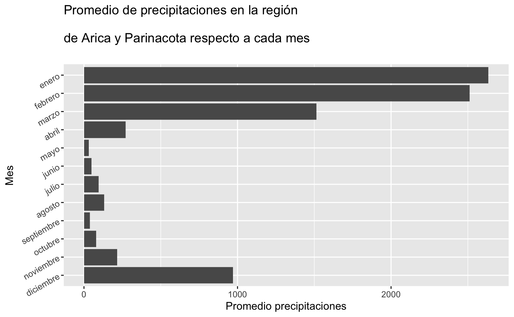

